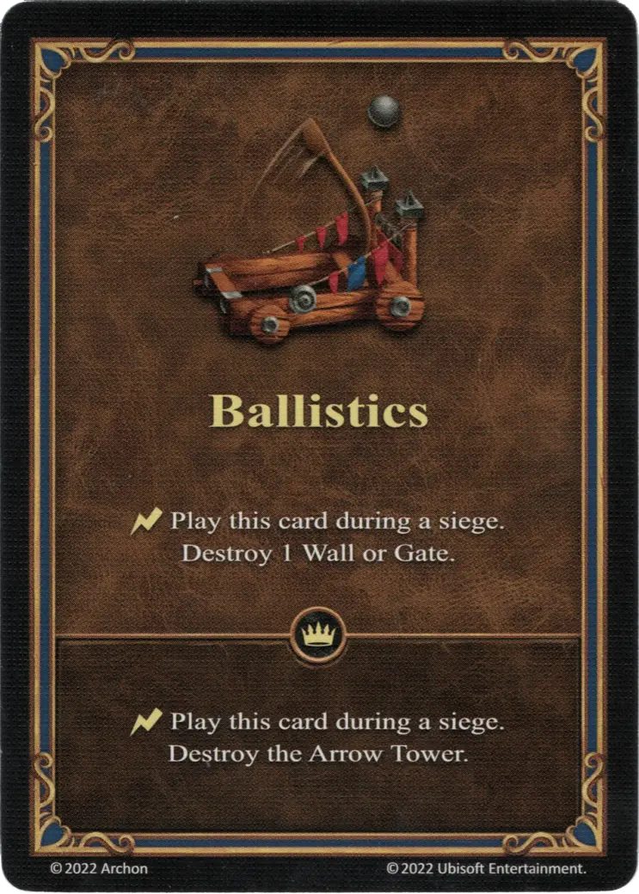

# Ballistics

=== "Regular"

    <figure markdown="span">
        { width="340" align=right }
    </figure>

=== "Empowered"

    <figure markdown="span">
        { width="340" align=right }
    </figure>

___

[Ability](index.md)

___

| Type | Effect | :expert: Effect |
| :--- | :---: | :---: |
| Regular | :instant: Play this card during a siege. Destroy 1 Wall or Gate. | :instant: Play this card during a siege. Destroy the [Arrow Tower](../units/arrow_tower.md). |
| Empowered | :instant: Play this card during a siege. Destroy 3 Walls and the Gate. | - |

## Comes With

- [Inferno Expansion](../content/inferno_expansion.md)
- [Regular Stretch Goals 2024](../content/regular_stretch_goals.md)
- [Naval Battles Expansion](../content/naval_battles_expansion.md) (Empowered)

## See Also

- [List of Abilities](index.md)
