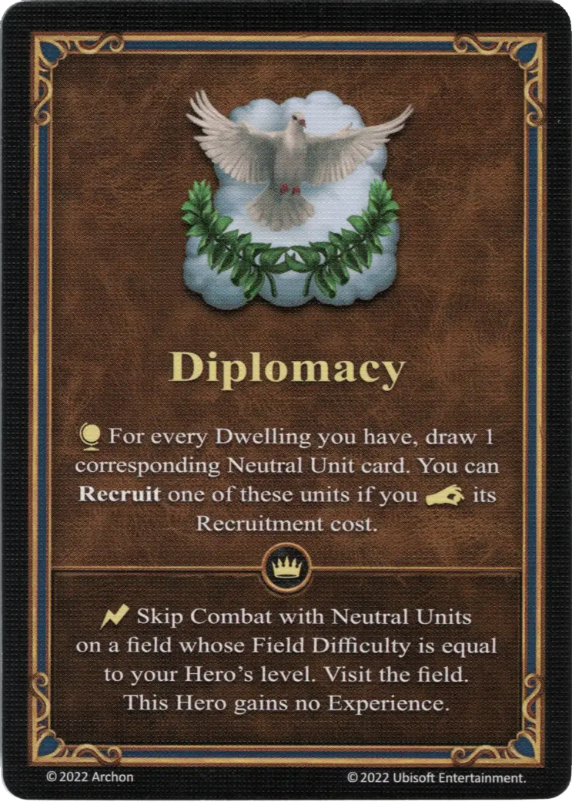

# Diplomacy

=== "Regular"

    <figure markdown="span">
        { width="340" align=right }
    </figure>

=== "Empowered"

    <figure markdown="span">
        { width="340" align=right }
    </figure>

___

[Ability](index.md)

___

| Type | Effect | :expert: Effect |
| :--- | :---: | :---: |
| Regular | :map_effect: For every [Dwelling](../towns/index.md#buildings) you have, draw 1 corresponding [Neutral Unit](../units/index.md) card. You can [**Recruit**](../keywords/recruit.md) one of these [units](../units/index.md) if you :pay: its Recruitment cost. | :instant: Skip Combat with [Neutral Units](../units/index.md#neutral-units) on a field whose [Field Difficulty](../tiles/index.md#difficulties) is equal to your Hero's level. Visit the field. This [Hero](../heroes/index.md) gains no Experience. |
| Empowered | :map_effect: For every [Dwelling](../towns/index.md#buildings) you have, draw 1 corresponding [Neutral Unit](../units/index.md) card. You can [**Recruit**](../keywords/recruit.md) one of these [units](../units/index.md) if you :pay: its Recruitment cost.  — OR —  :instant: Skip Combat with any [Neutral Units](../units/index.md) on the same level as your [Hero](../heroes/index.md). Claim the given [field](../fields/index.md) and resolve its effect. This [Hero](../heroes/index.md) gains no Experience. | - |

## Heroes With Starting Ability

- [:magic: Cyra](../heroes/cyra.md)

## Notes

- If the player already has a :gold_tier: dwelling, they draw cards from both, the :gold_tier: and :azure: Neutral decks.
- The recruitment costs for neutral units can be found on the card of the respective unit.
- For recruitment that happens as a result of using this ability, the recruitment token shall not be flipped. This means this ability may be used even after the player has already recruited units during this round.
- [^1] When played with miniatures (e.g. such as when playing on the large battlefield), this ability cannot be used to recruit units from a faction controller by another player, nor to recruit neutral units that are already recruited by another player. Should a player draw such card, that may not be recruited, they shall draw a replacement card instead.

## Comes With

- [Core Game](../content/core_game.md)
- [Regular Stretch Goals 2024](../content/regular_stretch_goals.md)
- [Naval Battles Expansion](../content/naval_battles_expansion.md) (Empowered)

## See Also

- [List of Abilities](index.md)
[^1]: Exceptions for specific game modes. This explanation is not valid for all game modes. The specific variant for the game mode is mentioned in the text.
