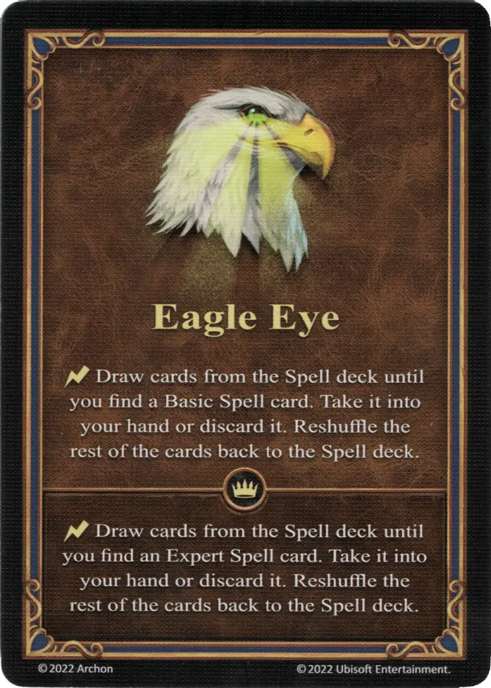

# Eagle Eye

=== "Regular"

    <figure markdown="span">
        { width="340" align=right }
    </figure>

=== "Empowered"

    <figure markdown="span">
        { width="340" align=right }
    </figure>

___

[Ability](index.md)

___

| Type | Effect | :expert: Effect |
| :--- | :---: | :---: |
| Regular | :instant: Draw cards from the [Spell](../spells/index.md) deck until you find a Basic [Spell](../spells/index.md) card. Take it into your hand or discard it. Reshuffle the rest of the cards back to the [Spell](../spells/index.md) deck. | :instant: Draw cards from the [Spell](../spells/index.md) deck until you find an Expert [Spell](../spells/index.md) card. Take it into your hand or discard it. Reshuffle the rest of the cards back to the [Spell](../spells/index.md) deck. |
| Empowered | :instant: Choose one: [Basic Spell](../spells/index.md#basic-spells), [Expert Spell](../spells/index.md#expert-spells), or [School of Magic](../spells/index.md#schools). Then, draw a card from the [Spell](../spells/index.md) deck until you find a chosen type of card. Take it into your hand or discard it. Reshuffle the rest of the cards back to the [Spell](../spells/index.md) deck. | - |

## Heroes With Starting Ability

- [:magic: Ash](../heroes/ash.md)

## Comes With

- [Fortress Expansion](../content/fortress_expansion.md)
- [Regular Stretch Goals 2024](../content/regular_stretch_goals.md)
- [Naval Battles Expansion](../content/naval_battles_expansion.md) (Empowered)

## See Also

- [List of Abilities](index.md)
- [List of Spells](../spells/index.md)
