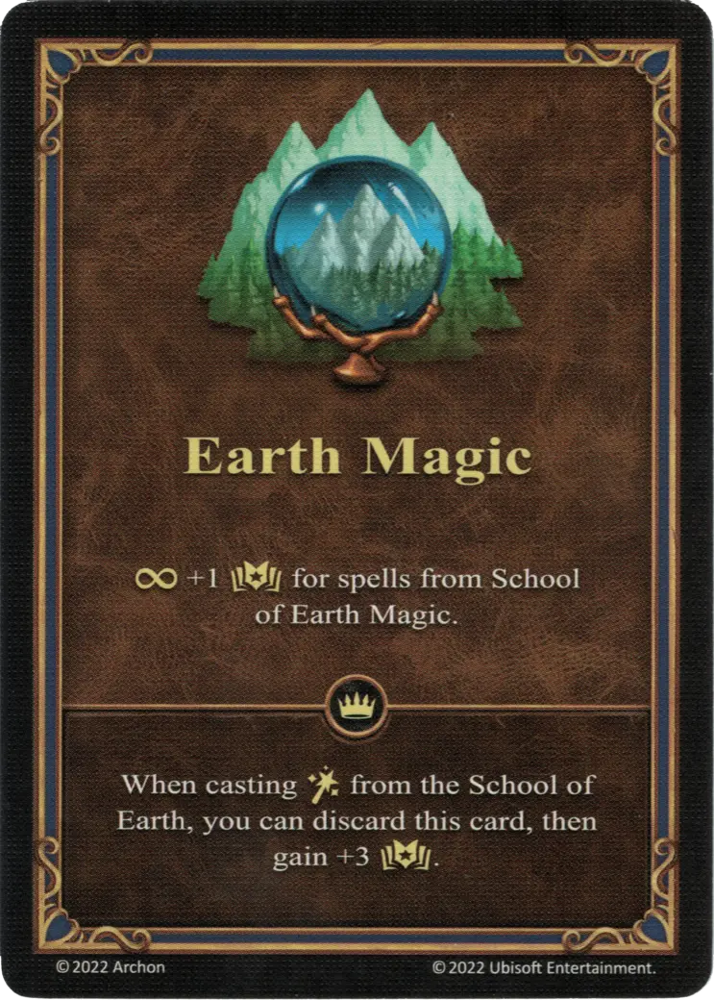

# Earth Magic

{ width="340" align=right }

___

[Ability](index.md)

___

:permanent: +1 :empower: for spells from [School of Earth Magic](../spells/school_of_earth_magic.md).

___

 :expert: 

When casting :spellpower: from the [School of Earth](../spells/school_of_earth_magic.md), you can discard this card, then gain +3 :empower:.

___

## Notes

- The expert effect may be played either from hand, or from the field. This does, however, not add the two effects, and the ability is put into the discard pile after being played.
- See [Permanent Effect](../keywords/permanent_effect.md)

## Comes With

- [Tower Expansion](../content/tower_expansion.md)
- [Regular Stretch Goals 2024](../content/regular_stretch_goals.md)

## See Also

- [Earth Magic (Empowered)](earth_magic_empowered.md)
- [List of Abilities](index.md)
- [School of Earth Magic](../spells/school_of_earth_magic.md)
