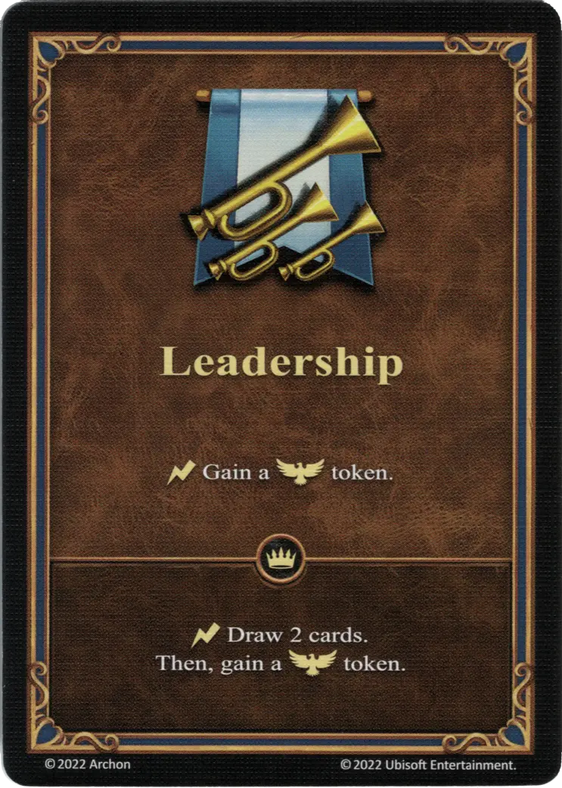

# Leadership

=== "Regular"

    <figure markdown="span">
        { width="340" align=right }
    </figure>

=== "Empowered"

    <figure markdown="span">
        { width="340" align=right }
    </figure>

___

[Ability](index.md)

___

| Type | Effect | :expert: Effect |
| :--- | :---: | :---: |
| Regular | :instant: Gain a :morale_positive: token. | :instant: Draw 2 cards. Then, gain a :morale_positive: token. |
| Empowered | :instant: Draw 2 cards. Then, gain a :morale_positive: token. | - |

## Heroes With Starting Ability

- [:might: Catherine](../heroes/catherine.md)
- [:might: Mephala](../heroes/mephala.md)
- [:might: Tarnum (Rampart)](../heroes/tarnum_rampart.md)

## Comes With

- [Core Game](../content/core_game.md)
- [Regular Stretch Goals 2024](../content/regular_stretch_goals.md)
- [Naval Battles Expansion](../content/naval_battles_expansion.md) (Empowered)

## See Also

- [List of Abilities](index.md)
