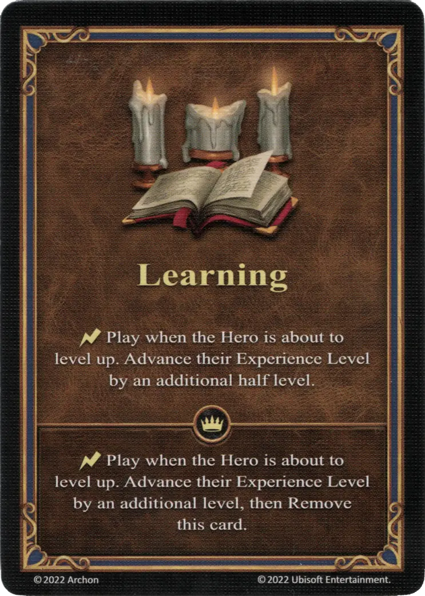

# Learning

{ width="340" align=right }

___

Ability

___

:instant: Play when the Hero is about to level up. Advance their :experience: Level by an additional half level.

___

 :expert: 

:instant: Play when the Hero is about to level up. Advance their :experience: Level by an additional level, then Remove this card.

___

## Comes With

- [Fortress Expansion](../content.md)

## See Also

- [List of Abilities](index.md)
