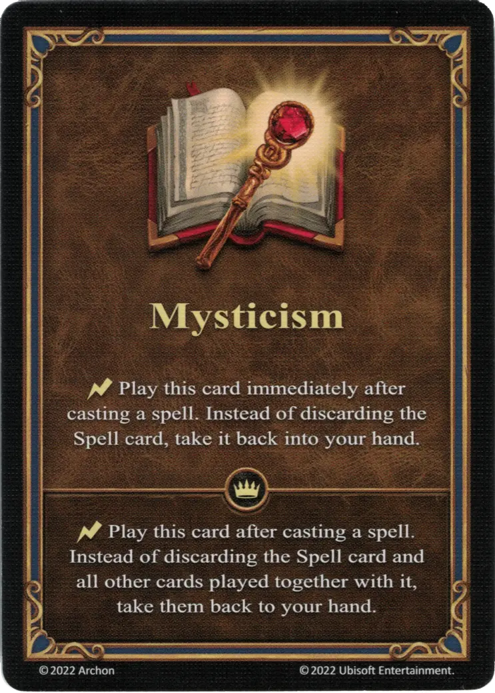

# Mysticism

=== "Regular"

    <figure markdown="span">
        { width="340" align=right }
    </figure>

=== "Empowered"

    <figure markdown="span">
        { width="340" align=right }
    </figure>

___

[Ability](index.md)

___

| Type | Effect | :expert: Effect |
| :--- | :---: | :---: |
| Regular | :instant: Play this card immediately after casting a [spell](../spells/index.md). Instead of discarding the [Spell](../spells/index.md) card, take it back into your hand. | :instant: Play this card immediately after casting a [spell](../spells/index.md). Instead of discarding the [Spell](../spells/index.md) card and all other cards played together with it, take them back to your hand. |
| Empowered | :instant: Play this card immediately after casting a [spell](../spells/index.md). Instead of discarding the [Spell](../spells/index.md) card and all other cards played together with it, take them back to your hand. | - |

## Heroes With Starting Ability

- [:magic: Ingham](../heroes/ingham.md)
- [:might: Torosar](../heroes/torosar.md)

## Comes With

- [Core Game](../content/core_game.md)
- [Regular Stretch Goals 2024](../content/regular_stretch_goals.md)
- [Naval Battles Expansion](../content/naval_battles_expansion.md) (Empowered)

## See Also

- [List of Abilities](index.md)
- [List of Spells](../spells/index.md)
