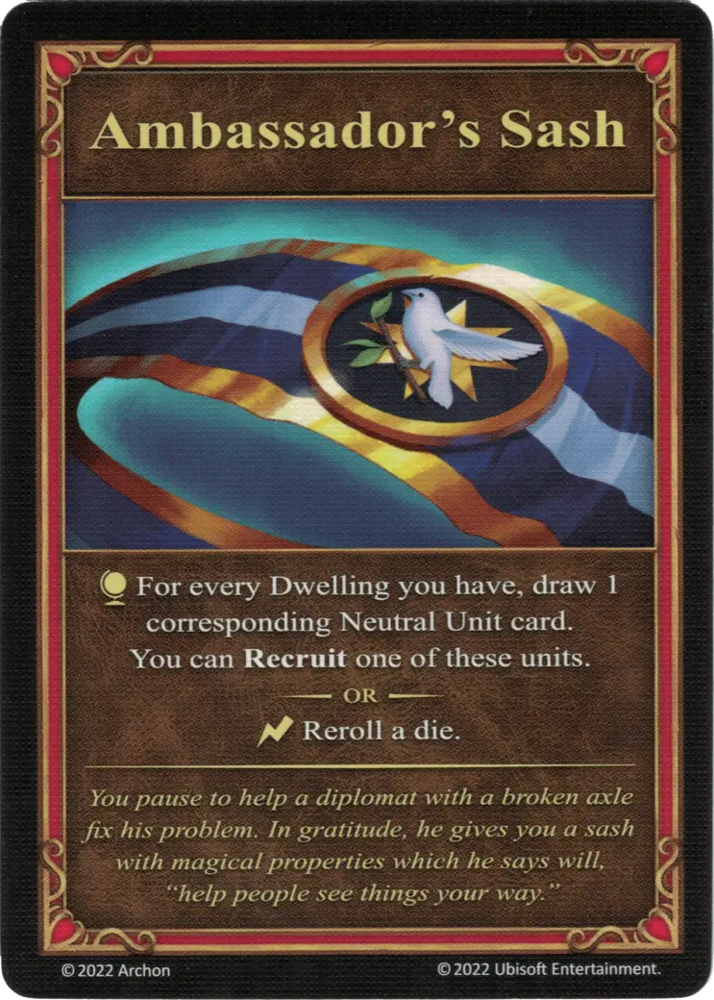

# Ambassador's Sash

{ width="340" align=right }
___

[Major Artifact](index.md#major-artifacts)

___

:map_effect: For every [Dwelling](../keywords/dwelling.md) you have, draw 1 corresponding [Neutral Unit](../units/index.md) card. You can [**Recruit**](../keywords/recruit.md) one of these units.  — OR —  :instant: Reroll a [die](../keywords/dice.md).

___

*You pause to help a diplomat with a broken axle to fix his problem. In gratitude, he gives you a sash with magical properties which he says will, "help people see things your way."*

## Comes With

- [Rampart Expansion](../content/rampart_expansion.md)

## See Also

- [Diplomat's Ring](diplomats_ring.md)

- [List of Artifacts](index.md)
