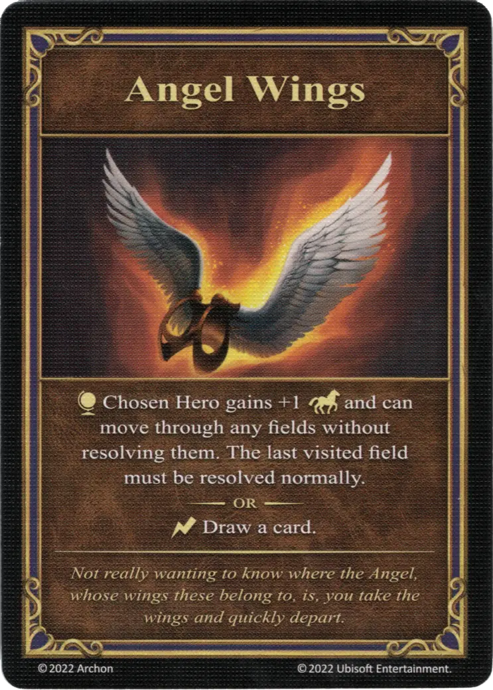

# Angel Wings

{ width="340" align=right }
___

[Relic Artifact](index.md#relic-artifacts)

___

:map_effect: Chosen [Hero](../heroes/index.md) gains +1 :movement_points: and can move through any fields without resolving them. The last visited field must be resolved normally.  — OR —  :instant: Draw a card.

___

*Not really wanting to know where the Angel, whose wings these belong to, is, you take the wings and quickly depart.*

## Notes

- After playing Angel Wings, the hero may move through borders and blocked fields. They may, however, not end their movement on a blocked field.
- See [Blocked Field](../fields/blocked_field.md)

## Comes With

- [Core Game](../content/core_game.md)

## See Also

- [List of Artifacts](index.md)
