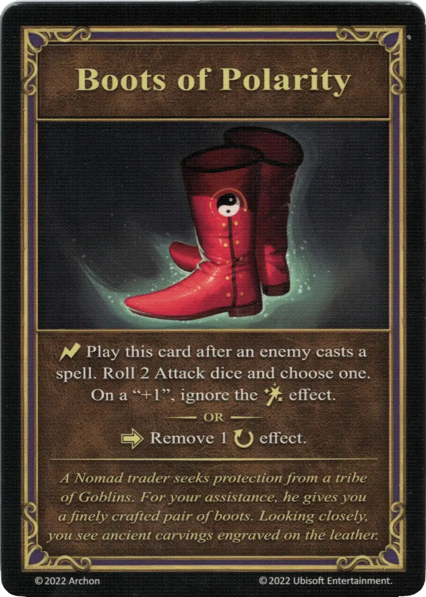

{ width="340" align=right }

# Boots of Polarity
___
Relic Artifact
___
:instant: Play this card after an enemy casts a [spell](../spells.md). Roll 2 [Attack dice](../dice.md#attack-die) and choose one. On a "+1 ", ignore the [:spellpower:](../spells.md) effect.  — OR —  :activation: Remove 1 :ongoing: effect.
___
*A Nomad trader seeks protection from a tribe of Goblins. For your assistance, he gives you a finely crafted pair of boots. Looking closely, you see ancient carvings engraved on the leather.*

## Comes With

- [Tower Expansion](../content.md)

## See Also

- [List of Artifacts](../artifacts.md)
