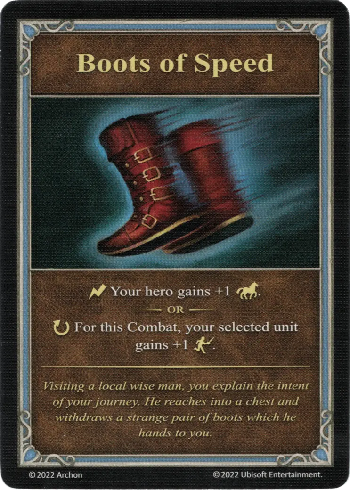

# Boots of Speed

{ width="340" align=right }
___

[Minor Artifact](index.md#minor-artifacts)

___

:instant: Your [hero](../heroes/index.md) gains +1 :movement_points:.  — OR —  :ongoing: For this Combat, your selected [unit](../units/index.md) gains +1 :initiative:.

___

*Visiting a local wise man, you explain the intent of your journey. He reaches into a chest and withdraws a strange pair of boots which he hands to you.*

## Comes With

- [Inferno Expansion](../content/inferno_expansion.md)

## See Also

- [List of Artifacts](index.md)
