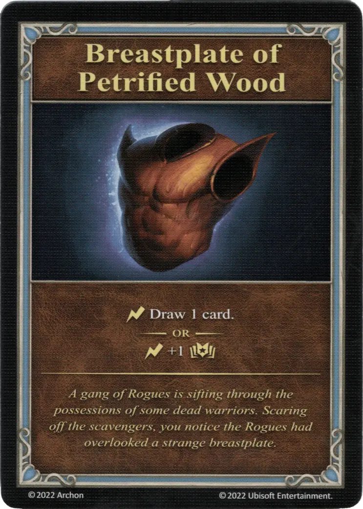

# Breastplate of Petrified Wood

{ width="340" align=right }
___

[Minor Artifact](index.md#minor-artifacts)

___

:instant: Draw 1 card.  — OR —  :instant: +1 :empower:

___

*A gang of Rogues is sifting through the possessions of some dead warriors. Scaring off the scavengers, you notice the Rogues had overlooked a strange breastplate.*

## Comes With

- [Core Game](../content/core_game.md)

## See Also

- [List of Artifacts](index.md)
