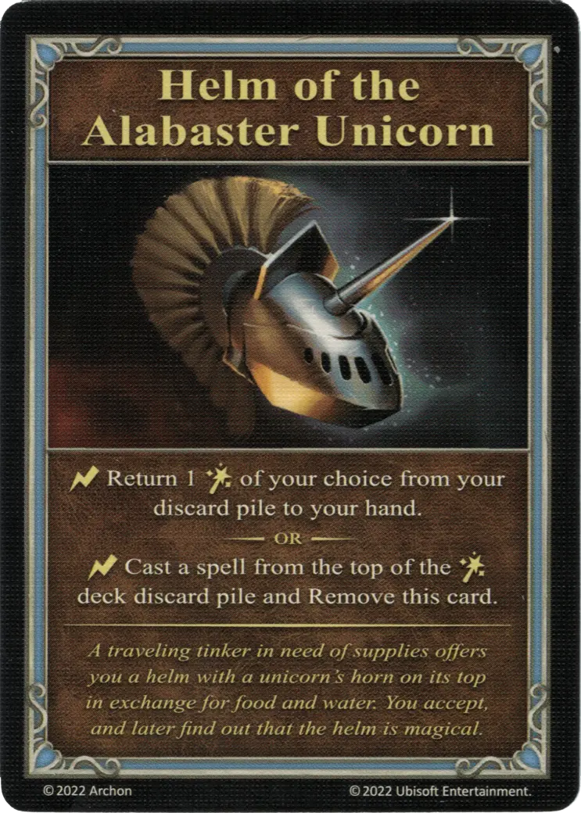

# Helm of the Alabaster Unicorn

{ width="340" align=right }
___

[Minor Artifact](index.md#minor-artifacts)

___

:instant: Return 1 [:spell:](../spells/index.md) of your choice from your discard pile to your hand.  — OR —  :instant: Cast a [spell](../spells/index.md) from the top of the [:spell:](../spells/index.md) deck discard pile and Remove this card.

___

*A traveling tinker in need of supplies offers your a helm with a unicorn's horn on its top in exchange for food and water. You accept, and later find out that the helm is magical.*

## Comes With

- [Tower Expansion](../content/tower_expansion.md)

## See Also

- [List of Artifacts](index.md)
