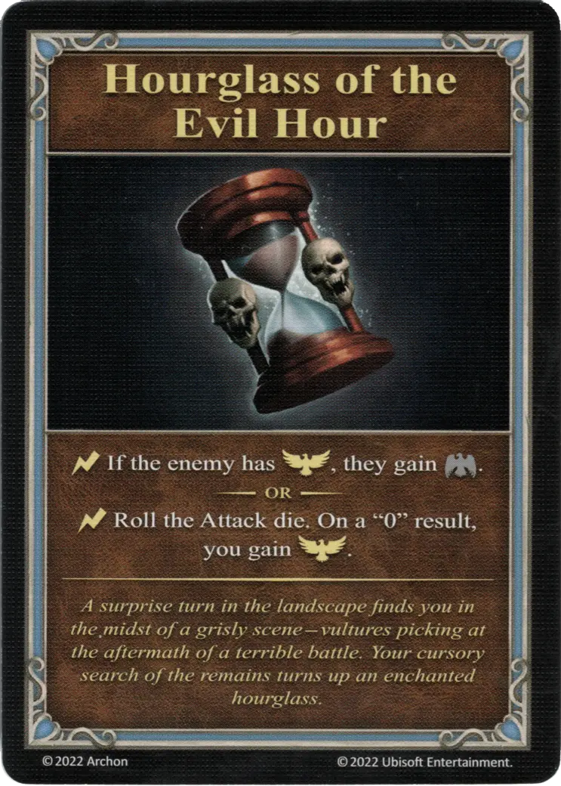

# Hourglass of the Evil Hour

{ width="340" align=right }
___

[Minor Artifact](index.md#minor-artifacts)

___

:instant: If the enemy has :positive_morale:, they gain :morale_negative:.  — OR —  :instant: Roll the [Attack die](../keywords/dice.md#attack-die). On a "0" result, you gain :positive_morale:.

___

*A surprise turn in the landscape finds you in the midst of a grisly scene - vultures picking at the aftermath of a terrible battle. Your cursory search of the remains turns up an enchanted hourglass.*

## Comes With

- [Core Game](../content/core_game.md)

## See Also

- [List of Artifacts](index.md)
