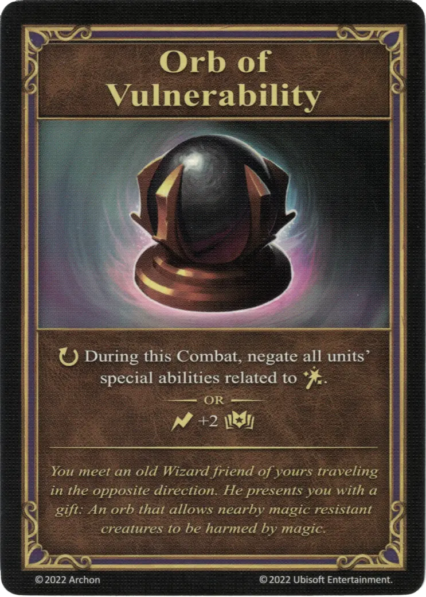

# Orb of Vulnerability

{ width="340" align=right }
___

[Relic Artifact](relic_artifacts.md)

___

:ongoing: During this Combat, negate all [units'](../units/index.md) special abilities related to [:spellpower:](../spells/index.md).  — OR —  :instant: +2 :empower:

___

*You meet an old Wizard fiend of yours traveling inthe opposite direction. He presents you with a gift: An orb that allows nearby magic resistant creatures to be harmed by magic.*

## Comes With

- [Rampart Expansion](../content.md)

## See Also

- [List of Artifacts](index.md)
