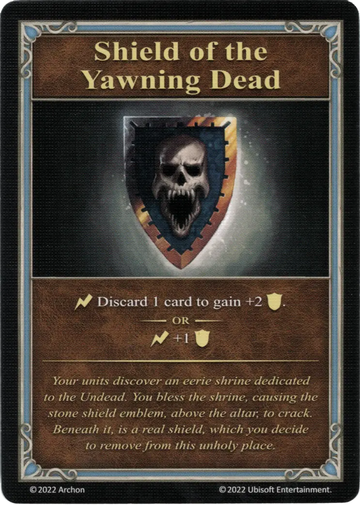

{ width="340" align=right }

# Shield of the Yawning Dead
___
Minor Artifact
___
:instant: Discard 1 card to gain +2 :defense:.  — OR —  :instant: +1 :defense:
___
*Your units discover an eerie shrine dedicated to the Undead. You bless the shrine, causing the stone shield emblem, above the altar, to crack. Beneath it, is a real shield, which you decide to remove from this unholy place.*

## Comes With

- [Core Game](../content.md)

## See Also

- [List of Artifacts](../artifacts.md)
