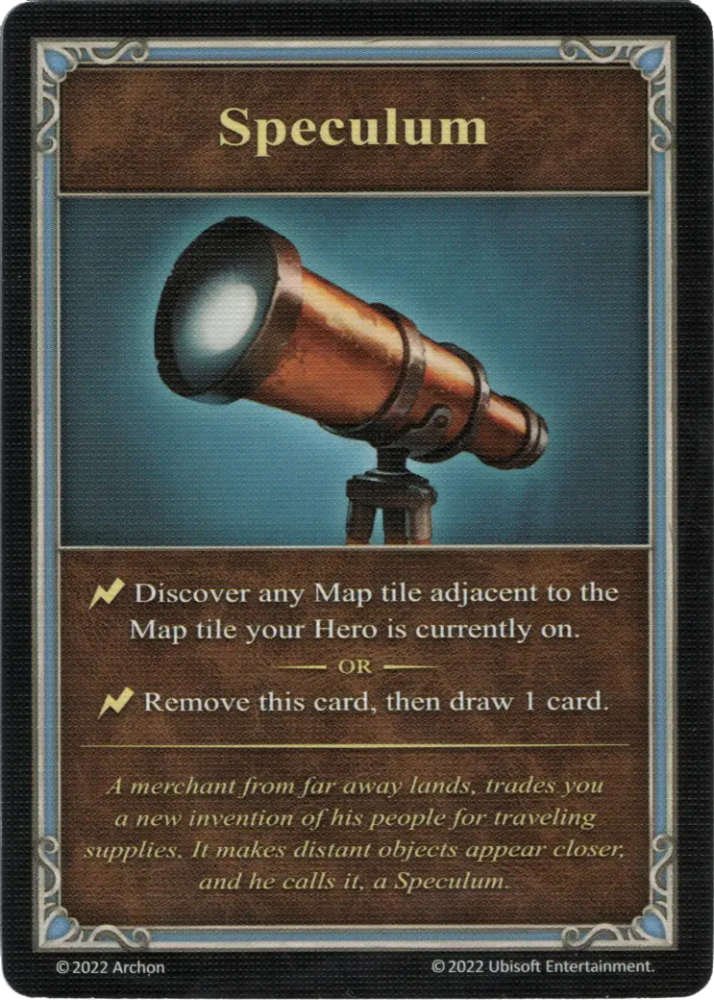

{ width="340" align=right }

# Speculum
___
Minor Artifact
___
:instant: Discover any Map tile adjacent to the Map tile your [Hero](../heroes.md) is currently on..  — OR —  :instant: Remove this card, then draw 1 card.
___
*A merchant from far away lands, trades you a new invention of his people for traveling supplies. It makes distant objects appear closer, and he calls it, a Speculum.*

## Comes With

- [Core Game](../content.md)

## See Also

- [List of Artifacts](../artifacts.md)
