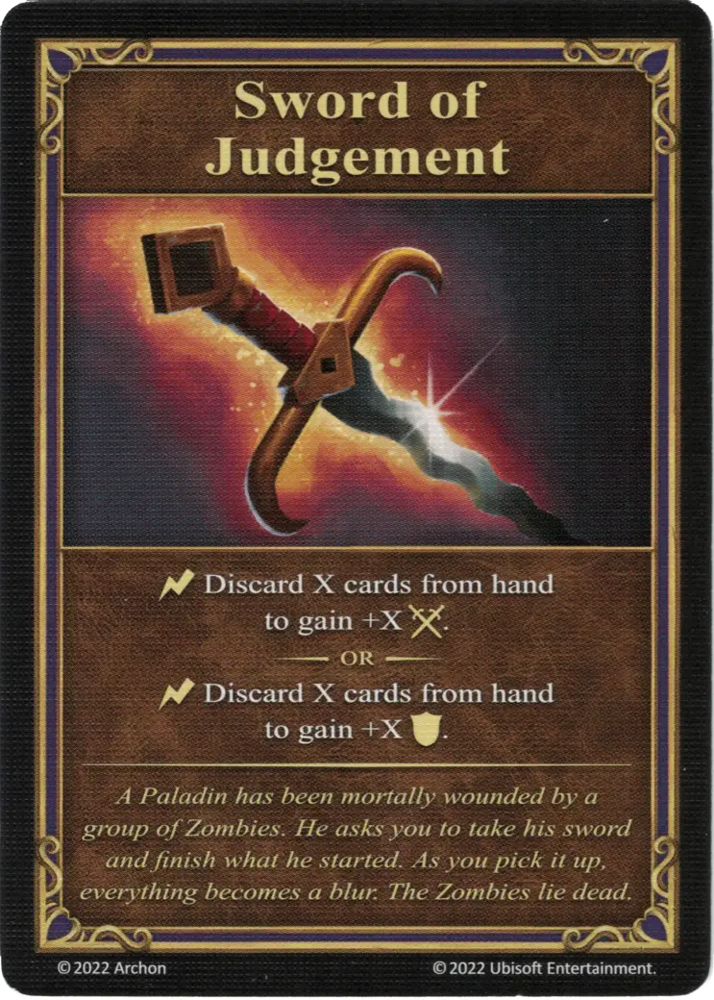

# Sword of Judgement

{ width="340" align=right }
___

[Relic Artifact](index.md#relic-artifacts)

___

:instant: Discard X cards from hand to gain +X :attack:.  — OR —  :instant: Discard X cards from hand to gain +X :defense:.

___

*A Paladin has been mortally wounded by a group of Zombies. He asks you to take his sword and finish what he started. As you pick it up, everything becomes a blur. The Zombies lie dead.*

## Comes With

- [Core Game](../content/core_game.md)

## See Also

- [Helm of Heavenly Enlightenment](helm_of_heavenly_enlightenment.md)
- [Celestial Necklace of Bliss](celestial_necklace_of_bliss.md)
- [Armor of Wonder](armor_of_wonder.md)
- [Sandals of the Saint](sandals_of_the_saint.md)
- [Lion's Shield of Courage](lions_shield_of_courage.md)

- [List of Artifacts](index.md)
