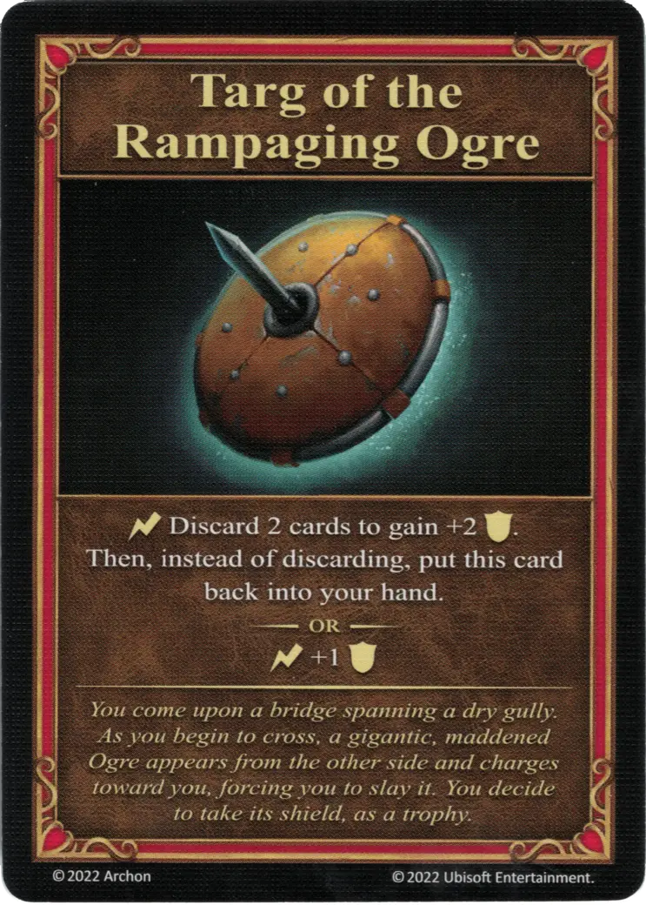

# Targ of the Rampaging Ogre

{ width="340" align=right }
___

Major Artifact

___

:instant: Discard 2 cards to gain +2 :defense:. Then, instead of discarding, put this card back into your hand.  — OR —  :instant: +1 :defense:

___

*You come upon a bridge spanning a dry gully. As you begin to cross, a gigantic, maddened Ogre appears from the other side and charges toward you, forcing you to slay it. You decide to take its shield, as a trophy.*

## Comes With

- [Core Game](../content.md)

## See Also

- [List of Artifacts](../artifacts.md)
