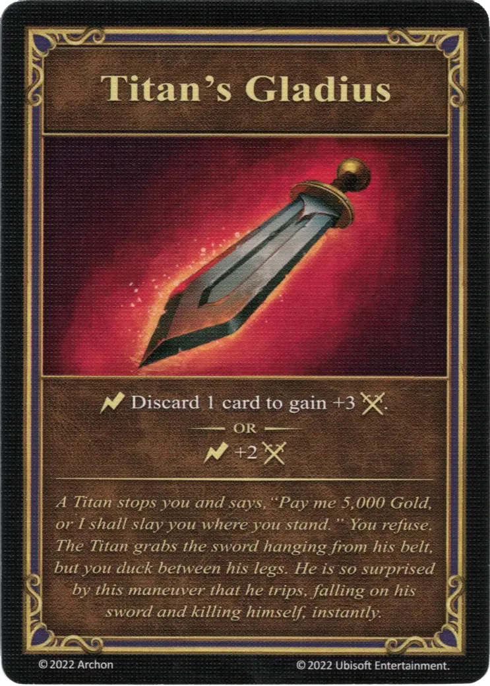

# Titan's Gladius

{ width="340" align=right }
___

[Relic Artifact](../keywords/relic_artifact.md)

___

:instant: Discard 1 card to gain +3 :attack:.  — OR —  :instant: +2 :attack:

___

*A Titan stops you and says, "Pay me 5,000 Gold, or I shall slay you where you stand." You refuse. The Titan grabs the sword hanging from his belt, but you duck between his legs. He is so surprised by this maneuver that he trips, falling on his sword and killing himself, instantly.*

## Comes With

- [Core Game](../content/core_game.md)

## See Also

- [Thunder Helmet](thunder_helmet.md)
- [Sentinel's Shield](sentinels_shield.md)
- [Titan's Cuirass](titans_cuirass.md)
- [List of Artifacts](index.md)
