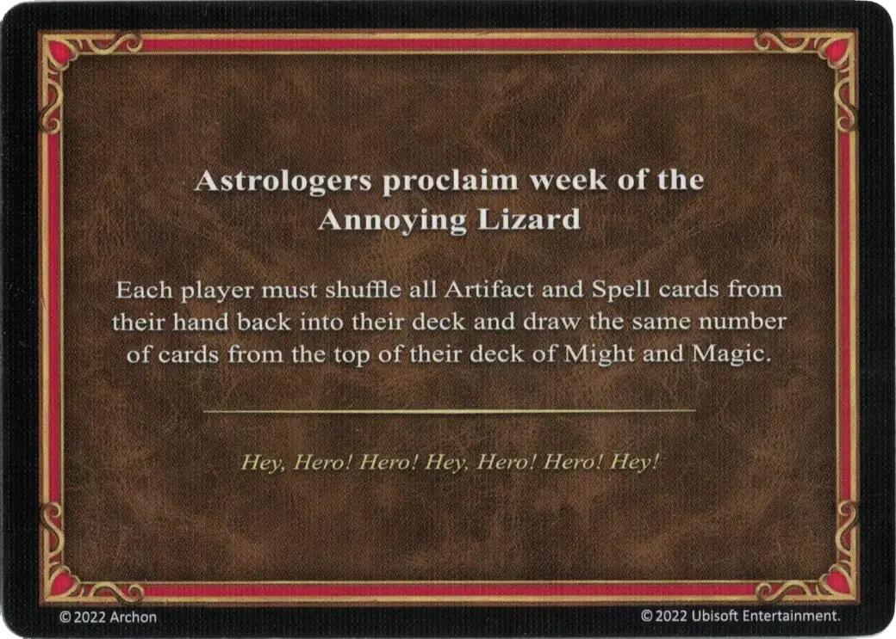

# Wkurzającej Jaszczurki

<figure markdown="span">

{ width="475" align=right }

</figure>

___

[Astrologowie Ogłaszają](index.md)

___

Każdy gracz musi wtasować wszystkie karty [Artefaktów](../artifacts/index.md) i [Zaklęć](../spells/index.md) z ręki do swojej talii M&M, a następnie dobrać taką samą liczbę kart z wierzchu swojej talii M&M.

___

*Tej, Bohaterze! Bohaterze! Tej, Bohaterze! Bohaterze! Tej!*

___

## Pochodzi z

- [Pudełko Podstawowe](../content/core_game.md)

## Zobacz też

- [Lista Artefaktów](../artifacts/index.md)
- [Lista kart Astrologowie Ogłaszają](index.md)
- [Lista Zaklęć](../spells/index.md)
