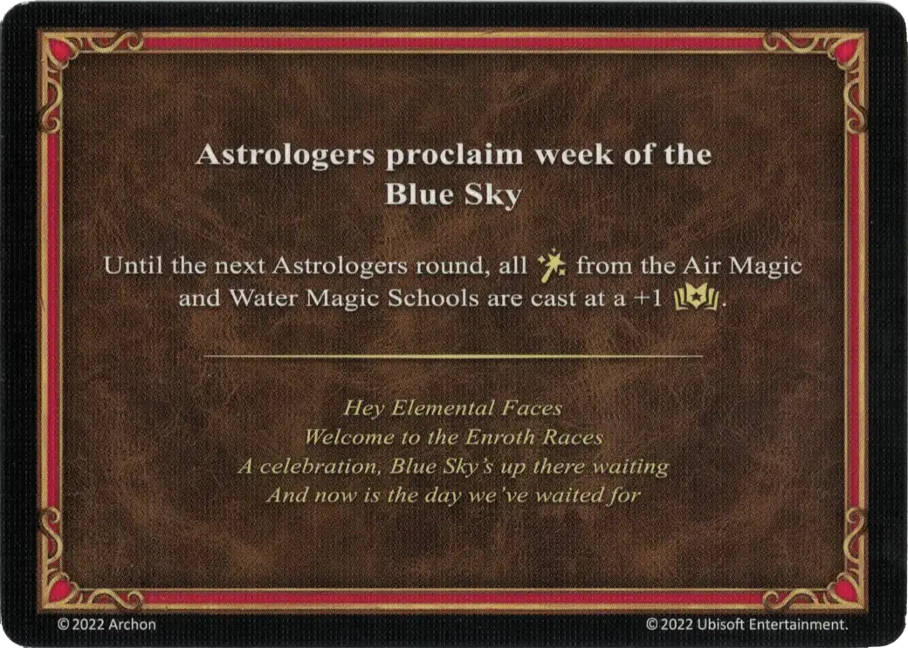

# Blue Sky

<figure markdown="span">

{ width="475" align=right }

</figure>

___

[Astrologers Proclaim](index.md)

___

Until the next Astrologers' round, all [:spellpower:](../spells/index.md) from the [Air Magic](../spells/school_of_air_magic.md) and [Water Magic](../spells/school_of_water_magic.md) Schools are cast at a +1 :empower:.

___

*Hey Elemental Faces Welcome to the Enroth Races A celebration, Blue Sky's up there waiting And now is the day we've waited for*

___

## Comes With

- [Tower Expansion](../content/tower_expansion.md)

## See Also

- [List of Astrologers Proclaim Cards](index.md)
- [List of Spells](../spells/index.md)
