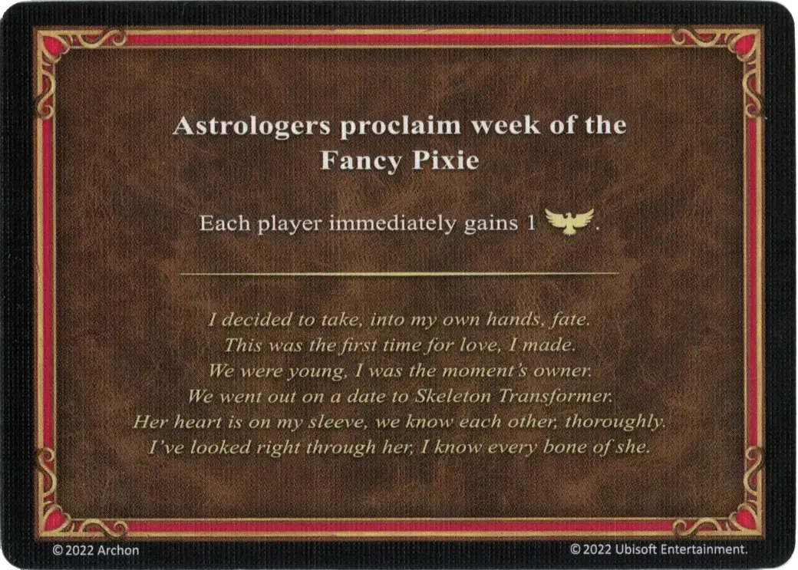

# Fikuśnej Nimfy

<figure markdown="span">

{ width="475" align=right }

</figure>

___

[Astrologowie Ogłaszają](index.md)

___

Każdy gracz natychmiast otrzymuje 1 :morale_positive:

___

*Więc postanowiłem los wziąc w swoje ręce, W ten sposób zdobyłem po raz pierwszy czyjeś serce, Byliśmy młodzi i byliśmy wolni, Poszliśmy na randkę do mej szkieletorni Jej serce mam w kieszeni, my znamy się na wskroś, Przejrzałem ją na wylot, znam jej każdą kość!*

___

## Pochodzi z

- [Pudełko Podstawowe](../content/core_game.md)

## Zobacz też

- [Lista kart Astrologowie Ogłaszają](index.md)
