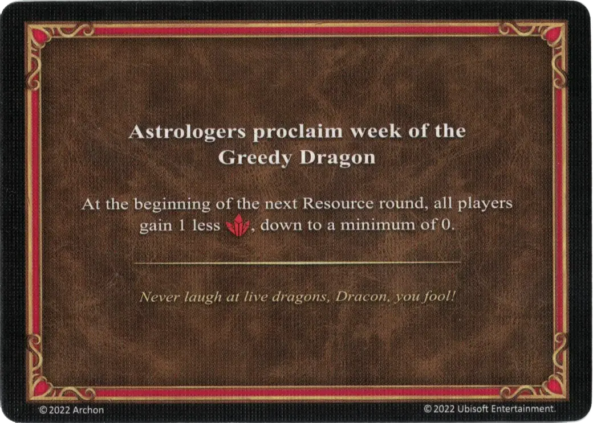

# Chciwego Smoka

<figure markdown="span">

{ width="475" align=right }

</figure>

___

[Astrologowie Ogłaszają](index.md)

___

Na początku najbliższej rundy Zasobów wszyscy gracze otrzymują o 1 :valuables: mniej (minimum 0).

___

*Dracon, głupcze! Nigdy więcej nie drwij z żywego smoka!*

___

## Pochodzi z

- [Pudełko Podstawowe](../content/core_game.md)

## Zobacz też

- [Lista kart Astrologowie Ogłaszają](index.md)
