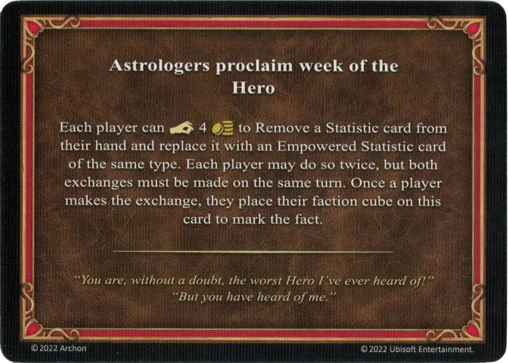

# Hero

<figure markdown="span">

{ width="475" align=right }

</figure>

___

Astrologers Proclaim

___

Each player can :pay: 4 :gold: to Remove a [Statistic](../statistics/index.md) card from their hand and replace it with an [Empowered Statistic](../statistics/index.md) card of the same type. Each player may do so twice, but both exchanges must be made on the same turn. Once a player makes the exchange, they place their faction cube on this card to mark the fact.

___

*"You are, without a doubt, the worst Hero I've ever head of!" "But you have heard of me."*

___

## Comes With

- [Inferno Expansion](../content.md)

## See Also

- [List of Astrologers Proclaim Cards](index.md)
- [List of Statistics](../statistics/index.md)
