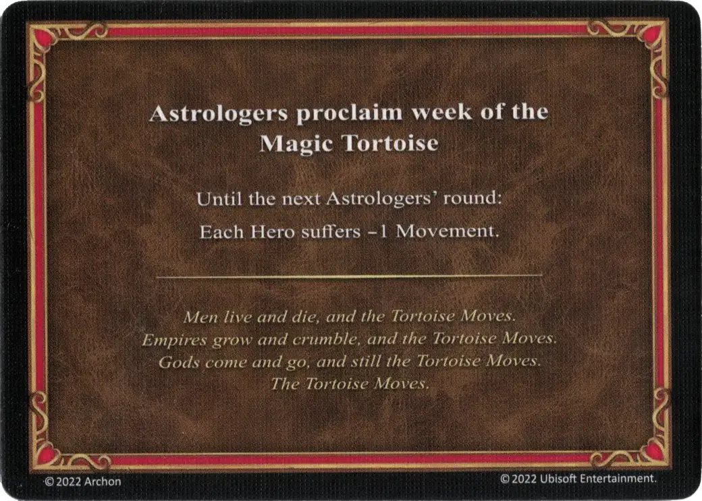

# Magic Tortoise

<figure markdown="span">

{ width="475" align=right }

</figure>

___

[Astrologers Proclaim](index.md)

___

Until the next Astrologer's round:  Each [Hero](../heroes/index.md) suffers -1 Movement.

___

*Men live and die, and the Tortoise Moves. Empires grow and crumble, and the Tortoise Moves. Gods come and go, and still the Tortoise Moves. The Tortoise Moves.*

___

## Comes With

- [Core Game](../content/core_game.md)

## See Also

- [List of Astrologers Proclaim Cards](index.md)
- [List of Heroes](../heroes/index.md)
