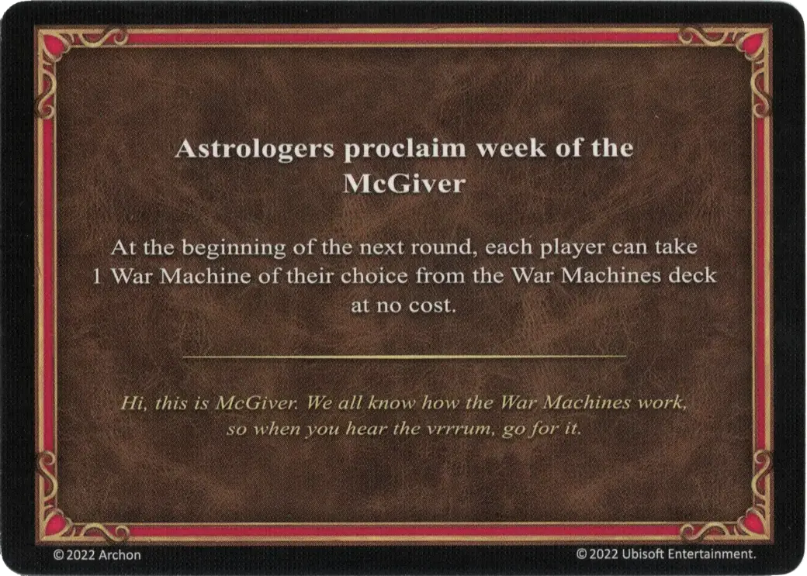

# McGiver

<figure markdown="span">

{ width="475" align=right }

</figure>

___

[Astrologers Proclaim](index.md)

___

At the beginning of the next round, each player can take 1 [War Machine](../war_machines/index.md) of their choice from the [War Machines](../war_machines/index.md) deck at not cost.

___

*Hi, this is McGiver. We all know how the War Machines work, so when you hear the vrrrum, go for it.*

___

## Comes With

- [Rampart Expansion](../content.md)

## See Also

- [List of Astrologers Proclaim Cards](index.md)
- [List of War Machines](../war_machines/index.md)
