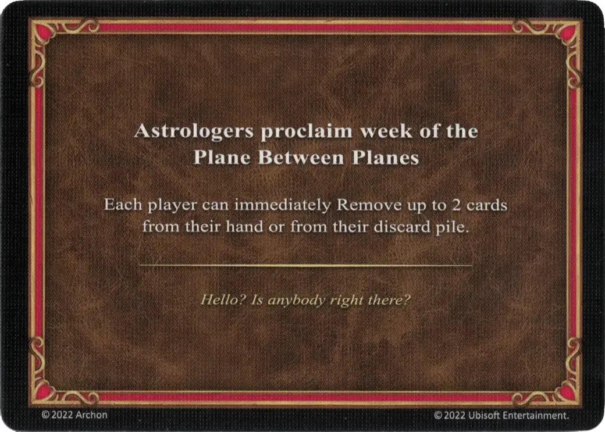

# Pięknego Bazyliszka

<figure markdown="span">

{ width="475" align=right }

</figure>

___

[Astrologowie Ogłaszają](index.md)

___

Każdy gracz może natychmiast Usunąć do 2 kart z ręki lub swojego stosu kart odrzuconych.

___

*Odkąd zobaczyłem ciebie Nie mogę iść, nie mogę wstać W łuskach twych nie widzę siebie Ślepia twe nie dają spać Przez twe oczy, te oczy zielone skamieniaaaaaałem*

___

## Pochodzi z

- [Rozszerzenie Cytadela](../content/fortress_expansion.md)

## Zobacz też

- [Lista kart Astrologowie Ogłaszają](index.md)
