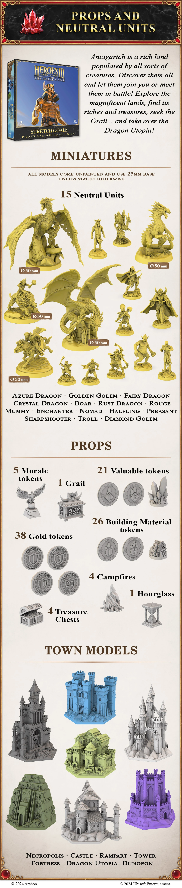
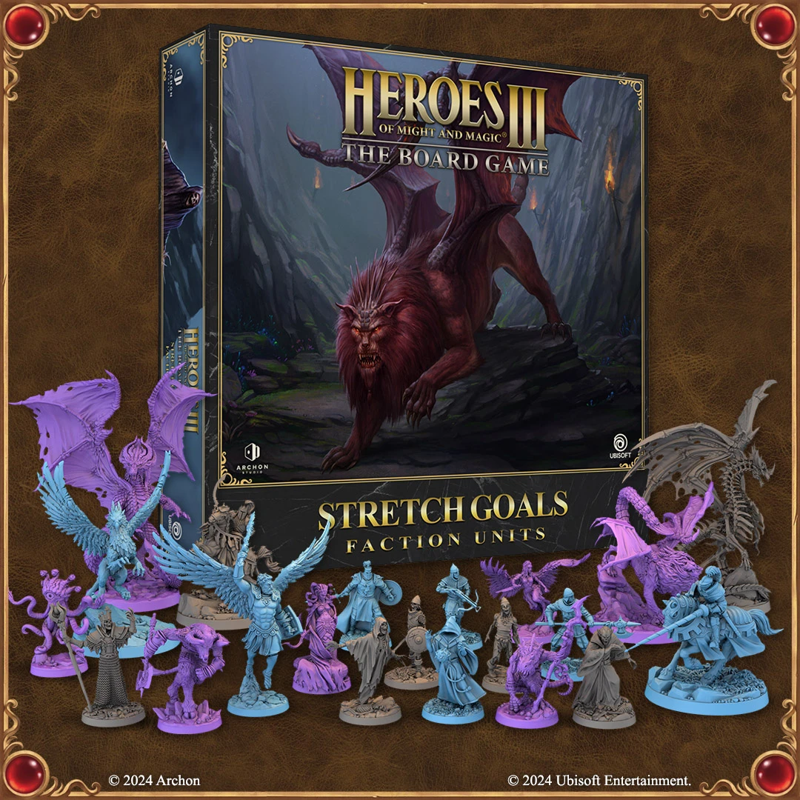

# Azure Stretch Goals 2022

<figure markdown="span">
	{ width=540 align=right }
</figure>
<figure markdown="span">
	{ width=540 align=right }
</figure>
<figure markdown="span">
	{ width=540 align=right }
</figure>
<figure markdown="span">
	{ width=540 align=right }
</figure>

## Inside The Box

- Props
- [Town Models](../towns/index.md)
- [Neutral Units Miniatures](../towns/neutral.md)
- Faction Units Miniatures

## Zobacz też

- [List of Content](index.md)
