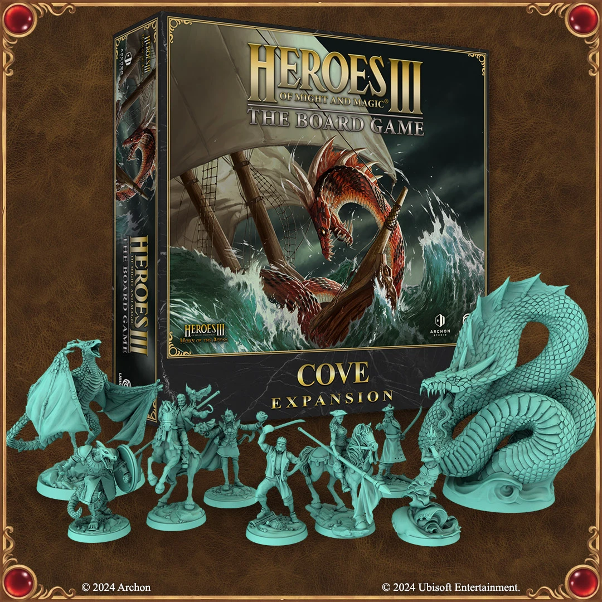

# Cove Expansion

<figure markdown="span">
	{ width=540 align=right }
</figure>
<figure markdown="span">
	{ width=540 align=right }
</figure>

## Inside The Box

- [Cove Faction](../towns/cove.md)
- [Sea Tiles](../tiles/index.md#sea-tiles)

## See Also

- [List of Content](index.md)
