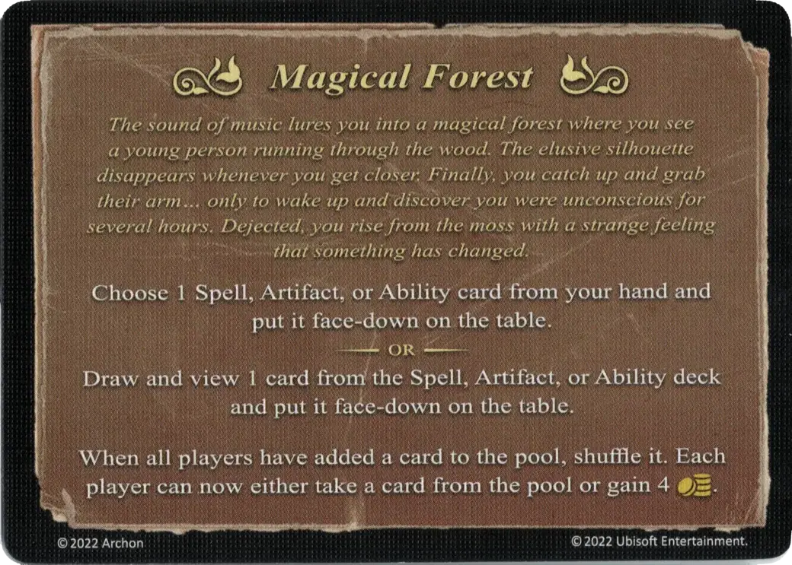

# Magical Forest

<figure markdown="span">

{ width="475" align=right }

</figure>

___

[Event](index.md)

___

Choose 1 [Spell](../spells/index.md), [Artifact](../artifacts/index.md), or [Ability](../abilities/index.md) card from your hand and put it face-down on the table.  — OR —  Draw and view 1 card from the [Spell](../spells/index.md), [Artifact](../artifacts/index.md), or [Ability](../abilities/index.md) deck and put it face-down on the table.  When all players have added a card to the pool, shuffle it. Each player can now either take a card from the pool or gain 4 :gold:.

___

*The sound of music lures you into a magical forest where you see a young person running through the wood. The elusive silhouette disappears whenever you get closer. Finally, you catch up and grab their arm... only to wake up and discover you were unconscious for several hours. Dejected, you rise from the moss with a strange feeling that something has changed.*

___

## Pochodzi z

- [Rozszerzenie Cytadela](../content/fortress_expansion.md)

## Zobacz też

- [List of Abilities](../abilities/index.md)
- [Lista Artefaktów](../artifacts/index.md)
- [Lista Wydarzeń](index.md)
- [Lista Zaklęć](../spells/index.md)
