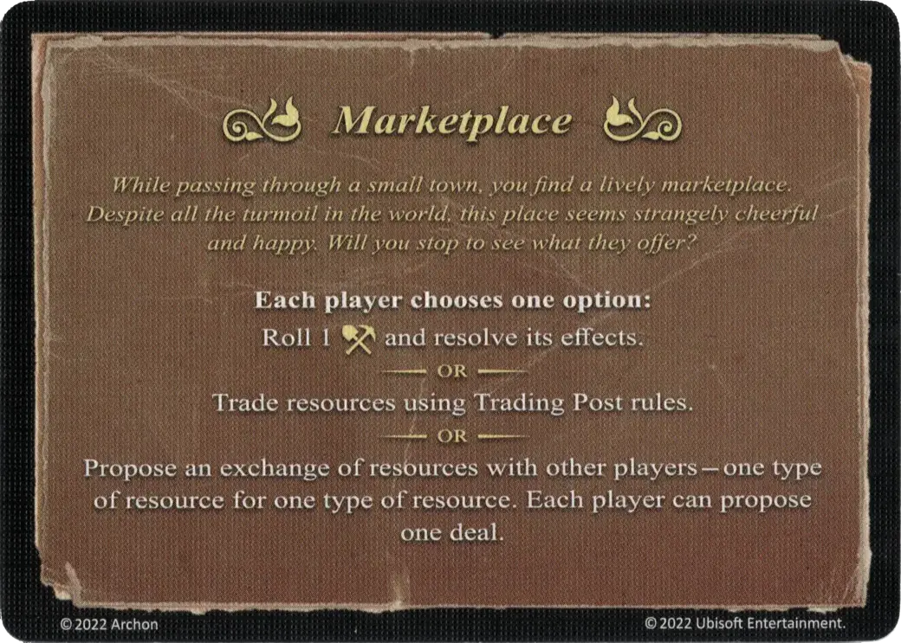

# Marketplace

<figure markdown="span">

{ width="475" align=right }

</figure>

___

[Event](index.md)

___

**Each player chooses one option:**  Roll 1 [:resource_die:](../dice.md#resource-die) and resolve its effects.  — OR —  [Trade](../trading.md) resources using Trading Post rules.  — OR —  Propose an exchange of resources with other players - one type of resource for one type of resource. Each player can propose one deal.

___

*While passing through a small town, you find a lively marketplace. Despite all the turmoil in the world, this place seems strangely cheerful and happy. Will you stop to see what they offer?*

___

## Pochodzi z

- [Rozszerzenie Cytadela](../content/fortress_expansion.md)

## Zobacz też

- [Lista Wydarzeń](index.md)
