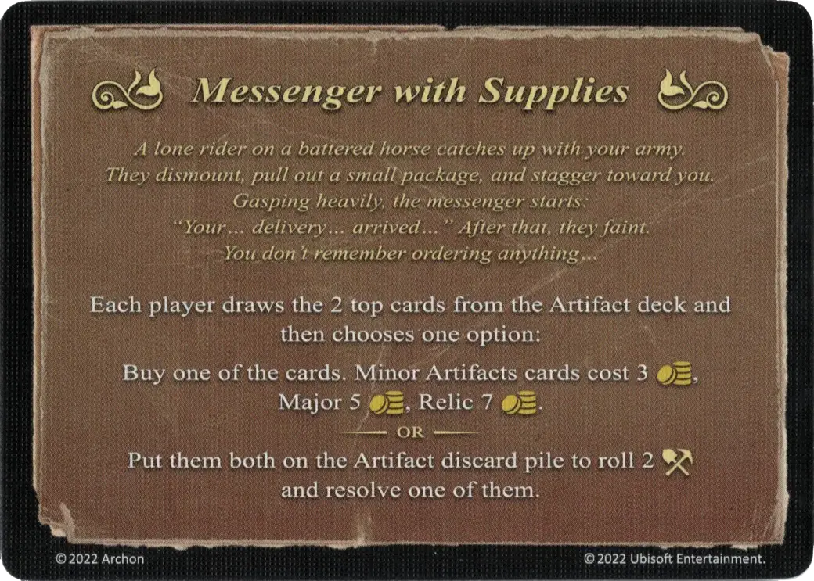

# Messenger with Supplies

<figure markdown="span">

{ width="475" align=right }

</figure>

___

[Event](index.md)

___

Each player draws 2 top cards from the [Artifact](../artifacts/index.md) deck and then chooses one option:  Buy one of the cards. [Minor Artifacts](../artifacts/minor_artifacts.md) cards cost 3 :gold:, [Major](../artifacts/major_artifacts.md) 5 :gold:, [Relic](../artifacts/relic_artifacts.md) 7 :gold:.  — OR —  Put them both on the [Artifact](../artifacts/index.md) discard pile to roll 2 [:trasuredie:](../dice.md#resource-die) and resolve one of them.

___

*A lone rider on a battered horse catches up with your army. They dismount, pull out a small package, and stagger toward you. Gasping heavily, the messenger starts: "Your... delivery... arrived..." After that, they faint. You don't remember ordering anything...*

___

## Comes With

- [Fortress Expansion](../content.md)

## See Also

- [List of Artifacts](../artifacts/index.md)
- [List of Events](index.md)
