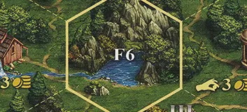

# Blocked Field

<figure markdown="span">

{ width="475" align=right }

</figure>

___

A blocked field is fully enclosed by a thick border and heroes are not allowed to enter it in general.

___

## Notes

- Blocked Field cannot be entered, but can be exited.
- [^1] Should a hero be allowed to enter a blocked field due to an effect, they may only *pass through*. That means that they are required to immediately use another movement point during the same turn to move out of the blocked field. If they would not be able to leave the field, they are not allowed to enter it.
- [^1] Should a hero need to retreat back to a blocked field, they are allowed to do so, as long as they have a spare movement point that they can use to also move out of the blocked field during the same turn. If they have no movement points left, they retreat back to the field they were standing on before moving to the blocked field instead.
- A hero is not allowed to end their turn on a blocked field.
- [^1] A field that is occupied by a player's hero may be used by the player's other hero to *pass through*. This means the hero needs to have another movement point available after moving to the field. Fields occupied by the player's heroes follow the same rules as blocked fields.

## See Also

- [Empty Filed](empty_field.md)
- [List of Fields](index.md)
- [List of Tiles](../tiles/index.md)

[^1]: Not officially confirmed by game designers, and is therefore considered a Community rule.