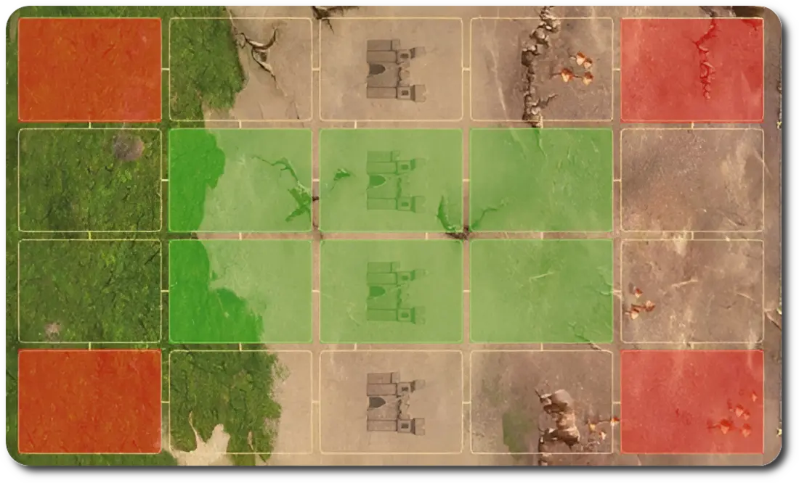

# Creature Bank

<figure markdown="span">

{ width="475" align=right }

</figure>

___

[Visitable Field](index.md#visitable-field)

___

Please refer to individual Creature Banks for effects.

___

A Creature Bank is not just a single field, it more of a field type, as there are multiple Creature Banks, each with their own set of guard [Units](../units/index.md) and rewards.
They can be either placed on the [Far (Ⅱ-Ⅲ) Map tiles](../tiles/index.md#far-tiles) or on the [Near (Ⅳ-Ⅴ) Map tiles](../tiles/index.md#near-tiles), based on the Roman numerals printed on the back of each Creature Bank token.

## Combat

<figure markdown="span">

{ width="600" align=right }

</figure>

P - Player Deployment Zone N - Guards (Neutral Units) Deployment Zone

When starting Combat at a Creature Bank, the player can place up to 5 of their [units](../units/index.md) in the player deployment zone.
Neutral guard [units](../units/index.md) corresponding to the Creature Bank being visited are then placed randomly in the guards deployment zone.
There is **no round limit** for challenging the Creature Bank guards.

## Difficulty

The [game difficulty](../difficulties.md) level affects the units guarding the Creature Bank by distributing Stacked tokens randomly among them. There can only be one token per unit.
Each token increased a single statistic of a [unit](../units/index.md) the following way:

- +1 :attack:
- +1 :defense:
- +1 :health_points:
- +2 :initiative:

Each difficulty increases the amount of tokens distributed.
The more Stack units there are, the greater the loot once all the guards are defeated.

| Difficulty | Tokens |
| :--- | :---: |
| Easy | 1 |
| Normal | 2 |
| Hard | 3 |
| Impossible | 4 |

## List of Creature Banks

| Name | Tile | Units | Reward | Extra |
| :--- | :---: | :--- | :--- | :--- |
| [Crypt](crypt_creature_bank.md) | [Far](../tiles/index.md#far-tiles) | 1x&nbsp;[Skeletons](../units/skeletons.md#crypt) 1x&nbsp;[Zombies](../units/zombies.md#crypt) 1x&nbsp;[Wraiths](../units/wraiths.md#crypt) 1x&nbsp;[Vampires](../units/vampires.md#crypt) | 6 :gold:. | 2 :gold: for every Stacked unit. |
| [Cyclops Stockpile](cyclops_stockpile_creature_bank.md) | [Near](../tiles/index.md#near-tiles) | 4x&nbsp;[Cyclopes](../units/cyclopes.md#cyclops-stockpile) | 8 :building_materials: and 2 :valuables:. | 2 :building_materials: and 1 :valuables: for every Stacked unit. |
| [Derelict Ship](derelict_ship_creature_bank.md) | [Near](../tiles/index.md#near-tiles) | 4x&nbsp;[Water&nbsp;Elementals](../units/water_elementals.md#derelict-ship) | [:positive_morale:](../keywords/morale.md#positive) and 7 :gold:. | 2 :gold: for every Stacked unit and [**Search(X)**](../keywords/search.md) the [Spell](../spells/index.md) deck, where X is the number of Stacked units. |
| [Dragon Fly Hive](dragon_fly_hive_creature_bank.md) | [Far](../tiles/index.md#far-tiles) | 4x&nbsp;[Dragon&nbsp;Flies](../units/dragon_flies.md#dragon-fly-hive) | 1x&nbsp;[Dragon&nbsp;Flies](../units/dragon_flies.md#dragon-fly-hive) unit. | If the Creature Bank was guarded by at least 2 Stacked units, gain Stacked [Dragon&nbsp;Flies](../units/dragon_flies.md#dragon-fly-hive) instead. |
| [Dragon Utopia](dragon_utopia_creature_bank.md) | [Near](../tiles/index.md#near-tiles) | 1x&nbsp;[Black&nbsp;Dragons](../units/black_dragons.md#dragon-utopia) 1x&nbsp;[Gold&nbsp;Dragons](../units/gold_dragons.md#dragon-utopia) 1x&nbsp;[Crystal&nbsp;Dragons](../units/crystal_dragons.md#dragon-utopia) 1x&nbsp;[Faerie&nbsp;Dragons](../units/faerie_dragons.md#dragon-utopia) | 40 :gold: and [**Search(3)**](../keywords/search.md) the [Artifact](../artifacts/index.md) deck. | [**Search(5)**](../keywords/search.md) the [Artifact](../artifacts/index.md) deck or the [Spell](../spells/index.md) deck for every Stacked unit. |
| [Dwarven Treasury](dwarven_treasury_creature_bank.md) | [Far](../tiles/index.md#far-tiles) | 4x&nbsp;[Dwarves](../units/dwarves.md#dwarven-treasury) | 7 :gold:. | 3 :gold: for every Stacked unit. |
| [Griffin Conservatory](griffin_conservatory_creature_bank.md) | [Near](../tiles/index.md#near-tiles) | 4x&nbsp;[Griffins](../units/griffins.md#griffin-conservatory) | 1x&nbsp;[Griffins](../units/griffins.md#griffin-conservatory) unit. | If the Creature Bank was guarded by at least 2 Stacked units, gain Stacked [Griffins](../units/griffins.md#griffin-conservatory) instead. |
| [Imp Cache](imp_cache_creature_bank.md) | [Far](../tiles/index.md#far-tiles) | 4x&nbsp;[Familiars](../units/familiars.md#imp-cache) | 3 :gold:. | 1 :gold: for every Stacked unit. |
| [Medusa Stores](medusa_stores_creature_bank.md) | [Far](../tiles/index.md#far-tiles) | 4x&nbsp;[Medusas](../units/medusas.md#medusa-stores) | 6 :gold: and 1 :valuables:. | 3 :gold: or 1 :valuables: for every Stacked unit. |
| [Naga Bank](naga_bank_creature_bank.md) | [Near](../tiles/index.md#near-tiles) | 4x&nbsp;[Nagas](../units/nagas.md#naga-bank) | 6 :gold: and 2 :valuables:. | 6 :gold: and 1 :valuables: for every Stacked unit. |
| [Pyramid](pyramid_creature_bank.md) | [Near](../tiles/index.md#near-tiles) | 2x&nbsp;[Gold&nbsp;Golems](../units/gold_golems.md#pyramid) 2x&nbsp;[Diamond&nbsp;Golems](../units/diamond_golems.md#pyramid) | [**Search(5)**](../keywords/search.md) the [Spell](../spells/index.md) deck. | For every Stacked unit, you may [Remove](../keywords/remove.md) 1 [Spell](../spells/index.md), [Ability](../abilities/index.md), or [Artifact](../artifacts/index.md) card from your hand or discard pile, then [**Search(5)**](../keywords/search.md) the appropriate deck. |
| [Shipwreck](shipwreck_creature_bank.md) | [Far](../tiles/index.md#far-tiles) | 4x&nbsp;[Wraiths](../units/wraiths.md#shipwreck) | [:positive_morale:](../keywords/morale.md#positive) and 5 :gold:. | 2 :gold: for every Stacked unit and [**Search(X)**](../keywords/search.md) the [Artifact](../artifacts/index.md) deck, where X is the number of Stacked units. |

## Notes

- Creature Bank Combat has no [field difficulty](../difficulties.md) level, so a Quick Combat is never going to happen at these locations. Additionally, these fields do not provide any :experience:.

## See Also

- [List of Fields](index.md)
- [List of Tiles](../tiles/index.md)
