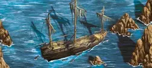

# Derelict Ship (Creature Bank)

<figure markdown="span">

{ width="475" align=right }

</figure>

___

[Visitable Field](index.md#visitable-field) [Creature Bank (Ⅳ-Ⅴ)](../fields/creature_bank.md)

___

| Units | Reward | Extra |
| :--- | :--- | :--- |
| 4x&nbsp;[Water&nbsp;Elementals](../units/water_elementals.md) | [:morale_positive:](../keywords/positive_morale.md) and 7 :gold:. | 2 :gold: for every Stacked unit and [**Search(X)**](../keywords/search.md) the [Spell](../spells/index.md) deck, where X is the number of Stacked units. |

___

## Notes

- This field is not considered a sea field.

## Comes With

- [Naval Battles Expansion](../content/naval_battles_expansion.md)

## See Also

- [Derelict Ship](derelict_ship.md)
- [List of Fields](index.md)
- [List of Tiles](../tiles/index.md)
