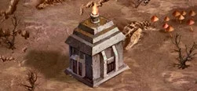

# Imp Cache (Creature Bank)

<figure markdown="span">

{ width="475" align=right }

</figure>

___

[Visitable Field](../keywords/visitable_field.md) [Creature Bank (Ⅱ-Ⅲ)](../fields/creature_bank.md)

___

| Units | Reward | Extra |
| :--- | :--- | :--- |
| 4x&nbsp;[Familiars](../units/familiars.md) | 3 :gold:. | 1 :gold: for every Stacked unit. |

___

## Comes With

- [Naval Battles Expansion](../content/naval_battles_expansion.md)

## See Also

- [List of Fields](index.md)
- [List of Tiles](../tiles/index.md)