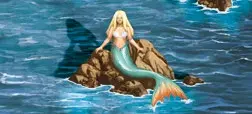

# Mermaid

<figure markdown="span">

{ width="475" align=right }

</figure>

___

[Visitable Field](../keywords/visitable_field.md)

___

The [Hero](../heroes/index.md) who entered this field gains 1 additional MP this turn. You also gain a [Positive Morale](../keywords/positive_morale.md) token.

___

## Notes

- Only appears on [Sea tiles](../keywords/sea_tile.md).

## See Also

- [Buoy](buoy.md)
- [Derelict Ship](derelict_ship.md)
- [Flotsam](flotsam.md)
- [Jetsam](jetsam.md)
- [Sea Barrel](sea_barrel.md)
- [Sea Chest](sea_chest.md)
- [Shipwreck](shipwreck.md)
- [Shipwreck Survivor](shipwreck_survivor.md)
- [Temple of the Sea](temple_of_the_sea.md)
- [List of Fields](index.md)
- [List of Tiles](../tiles/index.md)
