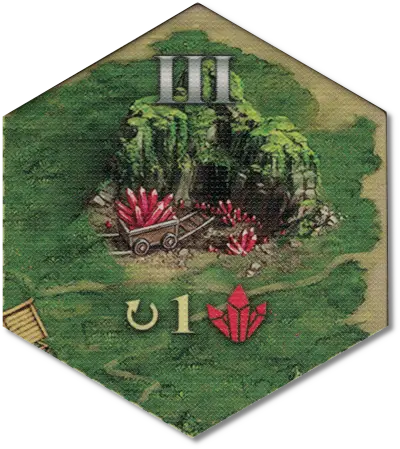

# Mine

<figure markdown="span">

{ width="340" align=right }
{ width="340" align=right }

</figure>

___

[Flaggable Field](index.md#flaggable-field)

___

When flagged, increases the specific resource income (shown on the field). The first player to flag the Mine also gains its income immediately. There are following types of Mines:  +5 :gold: income +2 :building_materials: income +1 :valuables: income

___

## See Also

- [List of Fields](index.md)
- [List of Tiles](../tiles/index.md)
