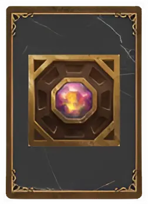

# Pandora's Box

<figure markdown="span">

{ width="475" align=right }

</figure>

___

[Visitable Field](index.md#visitable-field)

___

Roll 2 [Treasure Dice](../keywords/dice.md#treasure-die) and choose 1 result to gain.  — OR —  Roll 2 [Resource Dice](../keywords/dice.md#resource-die) and choose 1 result to gain.

___

## Cards

Instead of resolving the effects of Pandora's Box as usual, you may choose to draw a card from the Pandora's box deck instead.

<figure markdown="span">

{ width="200" align=left }

<figcaption>Back side of a pandora card.</figcaption>

</figure>

Below is a list of all effects of pandora cards.

| Effect |
| :---: |
| Gain 1 :experience:.  — OR —  One of your [Heroes](../heroes/index.md) gains 1 :movement_points:. |
| Look at the top 3 cards from the [Ability](../abilities/index.md) deck, discard up to 2 of them and place the rest back on top of the deck in any order. Gain 1 :valuables:. |
| Look at the top 3 cards from the [Spell](../spells/index.md) deck, discard up to 2 of them and place the rest back on top of the deck in any order. Gain 2 :building_materials:. |
| Look at the top 3 cards from the [Artifact](../artifacts/index.md) deck, discard up to 2 of them and place the rest back on top of the deck in any order. Gain 3 :gold:. |
| Look at the top 3 cards from the [Astrologers Proclaim](../astrologers_proclaim/index.md) deck, discard up to 2 of them and place the rest back on top of the deck in any order. [**Search(2)**](../keywords/index.md) the [Artifact](../artifacts/index.md) deck. |
| Draw 3 cards from the [:silver_tier: Neutral Unit](../units/index.md) deck. You can [Recruit](../keywords/recruit.md) one of these [units](../units/index.md) if you pay half of its :recruit: rounded up. |
| [**Search(5)**](../keywords/index.md) the [Ability](../abilities/index.md) deck.  — OR —  Roll 2 [:treasure_die:](../keywords/dice.md#treasure-die). If you roll at least 1 :artifact: Symbol, [**Search(8)**](../keywords/index.md) the [Ability](../abilities/index.md) deck. |
| [**Search(5)**](../keywords/index.md) the [Spell](../spells/index.md) deck.  — OR —  Roll 2 [:treasure_die:](../keywords/dice.md#treasure-die). If you roll at least 1 :artifact: Symbol, [**Search(8)**](../keywords/index.md) the [Spell](../spells/index.md) deck. |
| [**Search(5)**](../keywords/index.md) the [Artifact](../artifacts/index.md) deck.  — OR —  Roll 2 [:treasure_die:](../keywords/dice.md#treasure-die). If you roll at least 1 :artifact: Symbol, [**Search(8)**](../keywords/index.md) the [Artifact](../artifacts/index.md) deck. |
| :permanent: +1 :power:. As long as this card is in play, at the end of your turn, [Remove](../keywords/remove.md) this card or gain [Negative Morale](../keywords/morale.md#negative) Remember, the effect of this card lasts only when the card is in play. |
| First, pay 3 :gold:, 2 :building_materials:, or 1 :valuables: up to six times, in any combination. Second, for each payment made, roll and resolve 1 [:resource_die:](../keywords/dice.md#resource-die). |
| :permanent: You can have up to 3 :permanent: cards played at a time, including this one. Remember, the effect of this card lasts only when the card is in play. |
| :permanent: Your :hand_limit: is increased by 1. Remember, the effect of this card lasts only when the card is in play. |
| :permanent: Roll 1 [:resource_die:](../keywords/dice.md#resource-die) and, based on the result, increase the income of the corresponding resource by 1 tier. Remember, the effect of this card lasts only when the card is in play. |
| If you do not have a :silver_tier:, discard this card and draw another. Otherwise, choose one:  Flip one of your :silver_tier: [units](../units/index.md) to the "Few" side.  — OR —  Discard one of your :silver_tier: [units](../units/index.md). Then, draw 3 cards from the :bronze_tier: [Neutral Unit](../units/index.md) deck, and 3 cards from the :silver_tier: [Neutral Unit](../units/index.md) deck. From these cards, [Recruit](../keywords/recruit.md) 1 :bronze_tier: and 1 :silver_tier: for free. |
| Roll and resolve 2 [:resource_die:](../keywords/dice.md#resource-die).  — OR —  Gain 9 :gold:. |
| [**Search(2)**](../keywords/index.md) the [Artifact](../artifacts/index.md) deck twice.  — OR —  [**Search(2)**](../keywords/index.md) the [Spell](../spells/index.md) deck twice. |
| One of your [Heroes](../heroes/index.md) gains 2 :movement_points:.  — OR —  [Remove](../keywords/remove.md) 1 card from your hand or your discard pile. |
| Gain 2 :experience:.  — OR —  [Remove](../keywords/remove.md) 1 card from your hand or your discard pile. |
| :instant: Choose 2 from these options:  Roll 2 [:resource_die:](../keywords/dice.md#resource-die) and resolve one of them.  — OR —  Gain :movement_points:.  — OR —  Gain 1 :experience:. |

## Notes

- Using a card still counts as resolving the location, therefore it is still marked with a black cube.

## Comes With

- [Regular Stretch Goals 2024](../content/regular_stretch_goals.md) - Cards

## See Also

- [List of Fields](index.md)
- [List of Tiles](../tiles/index.md)
