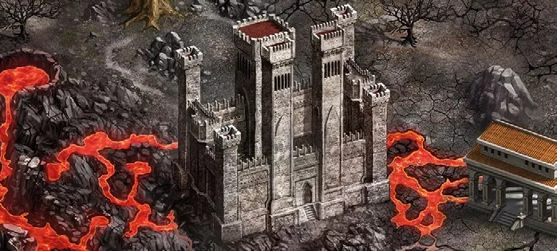

# Random Town

<figure markdown="span">

{ width="475" align=right }

</figure>

___

[Flaggable Field](index.md#flaggable-field)

___

When revealed, all players roll 2 [Resource dice](../keywords/dice.md#resource-die). The highest roller chooses an unused [Faction](../towns/index.md). The random [Town](../towns/index.md) is defended by [Units](../units/index.md) from that [Faction](../towns/index.md). They have a "Pack" of :bronze_tier:, two "Packs" of :silver_tier:, and two "Fews" of :golden: [Units](../units/index.md). The :bronze_tier: [Unit](../units/index.md) is chosen by the player who controls the [Units](../units/index.md) during that Combat.  When flagged, increases :gold: income by 10. The first player to flag the [Town](../towns/index.md) also gains its income immediately.

___

## See Also

- [List of Fields](index.md)
- [List of Tiles](../tiles/index.md)
