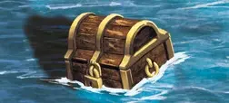

# Sea Chest

<figure markdown="span">

{ width="475" align=right }

</figure>

___

[Visitable Field](index.md#visitable-field)

___

Roll 1 [Attack Die](../keywords/attack_die.md). Depending on the result, do the following:  **+1** - [**Search(1)**](../keywords/search.md) [:artifact:](../artifacts/index.md).  **0** - Gain 5 :gold:.  **-1** - Gain nothing.

___

## Notes

- Only appears on [Sea tiles](../tiles/index.md#sea-tiles).

## See Also

- [Buoy](buoy.md)
- [Derelict Ship](derelict_ship.md)
- [Flotsam](flotsam.md)
- [Jetsam](jetsam.md)
- [Mermaid](mermaid.md)
- [Sea Barrel](sea_barrel.md)
- [Shipwreck](shipwreck.md)
- [Shipwreck Survivor](shipwreck_survivor.md)
- [Temple of the Sea](temple_of_the_sea.md)
- [List of Fields](index.md)
- [List of Tiles](../tiles/index.md)
