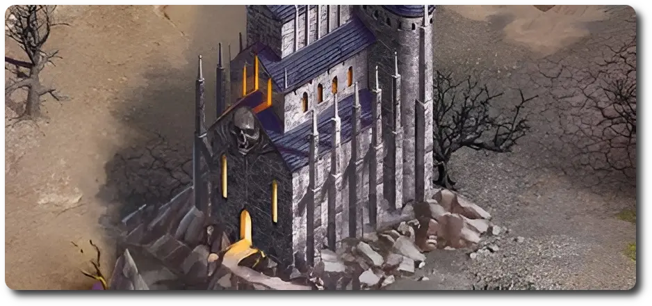
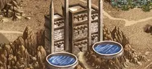

# Settlement

=== "Castle"

    <figure markdown="span">
        { width="475" align=right }
    </figure>

=== "Necropolis"

    <figure markdown="span">
        { width="475" align=right }
    </figure>

=== "Dungeon"

    <figure markdown="span">
        { width="475" align=right }
    </figure>

=== "Tower"

    <figure markdown="span">
        { width="475" align=right }
    </figure>

=== "Rampart"

    <figure markdown="span">
        { width="475" align=right }
    </figure>

=== "Fortress"

    <figure markdown="span">
        { width="475" align=right }
    </figure>

=== "Inferno"

    <figure markdown="span">
        { width="475" align=right }
    </figure>

=== "Stronghold"

    <figure markdown="span">
        { width="475" align=right }
    </figure>

=== "Conflux"

    <figure markdown="span">
        { width="475" align=right }
    </figure>

=== "Cove"

    <figure markdown="span">
        { width="475" align=right }
    </figure>

___

[Flaggable Field](index.md#flaggable-field)

___

Works as a spawn point for Secondary [Heroes](../heroes/index.md) or Main [Heroes](../heroes/index.md) that have been defeated.  Works the same way as a mine, but the player can choose which resource income to increase. The settlement is then marked with a token of the chosen resource.  — OR —  Reinforce one of your :bronze_tier: or :silver: [Units](../units/index.md) immediately for half the cost, rounded up. The first player to flag the settlement Reinforces that [Unit](../units/index.md) for free.

___

## See Also

- [List of Fields](index.md)
- [List of Tiles](../tiles/index.md)
