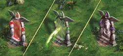

# Two-Way Monolith

<figure markdown="span">

{ width="475" align=right }

</figure>

___

[Revisitable Field](../keywords/revisitable_field.md)

___

When you enter this location, move your Hero to the corresponding Exit Monolith location. You can **use** the Exit Monolith to move back to the Entrance Monolith.

___

## See Also

- [One-Way Monolith](one_way_monolith.md)
- [List of Fields](index.md)
- [List of Tiles](../tiles/index.md)
