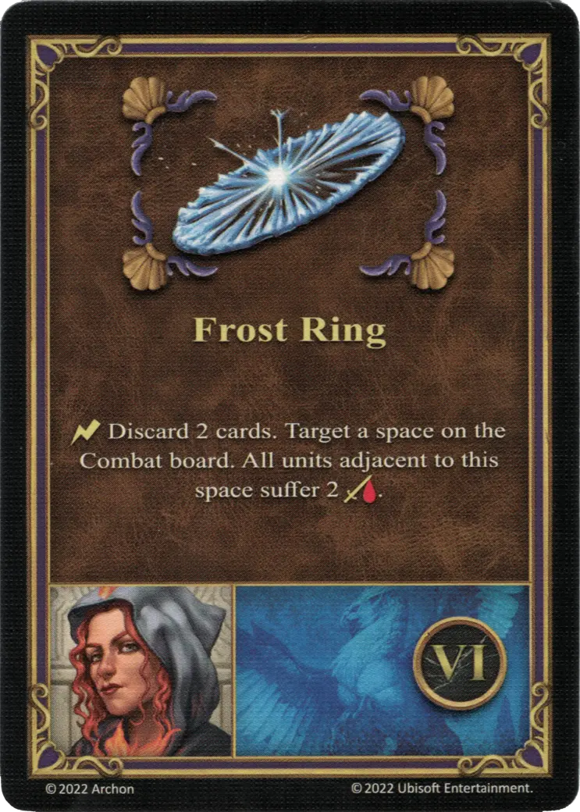

# Adelaide

{ width=540 align=right }

___

[:magic: Cleric](index.md)

___

[Castle](../towns/castle.md)

___

[:attack:](../statistics/attack.md)&nbsp;1 [:defense:](../statistics/defense.md)&nbsp;0 [:empower:](../statistics/power.md)&nbsp;2 [:skill:](../statistics/knowledge.md)&nbsp;2

___

[Wisdom](../abilities/wisdom.md)

___

## Specialty

=== "Frost Ring Ⅰ"

    <figure markdown="span">
        { width="340" align=right }
    </figure>

=== "Frost Ring Ⅳ"

    <figure markdown="span">
        { width="340" align=right }
    </figure>

=== "Frost Ring Ⅵ"

    <figure markdown="span">
        { width="340" align=right }
    </figure>

| Level | Description |
| :---: | :---: |
| Ⅰ | :instant: Discard 1 card. Target a space on the Combat board. All [units](../units/index.md) adjacent to this space suffer 1 :damage:. |
| Ⅳ | :instant: Select 1 [Spell](../spells/index.md) or Specialty card from your discard pile and put it back in your hand. |
| Ⅵ | :instant: Discard 2 cards. Target a space on the Combat board. All [units](../units/index.md) adjacent to this space suffer 2 :damage:. |

## Notes

- **Ⅰ and Ⅵ** - The :damage: from Frost Ring also applies to friendly units.
- These specialties can be played as *instant* effects at any time during Combat, not just during the friendly unit activations.

## Comes With

- [Tower Expansion](../content/tower_expansion.md)

## See Also

- [List of Heroes](index.md)
- [List of Towns](../towns/index.md)

