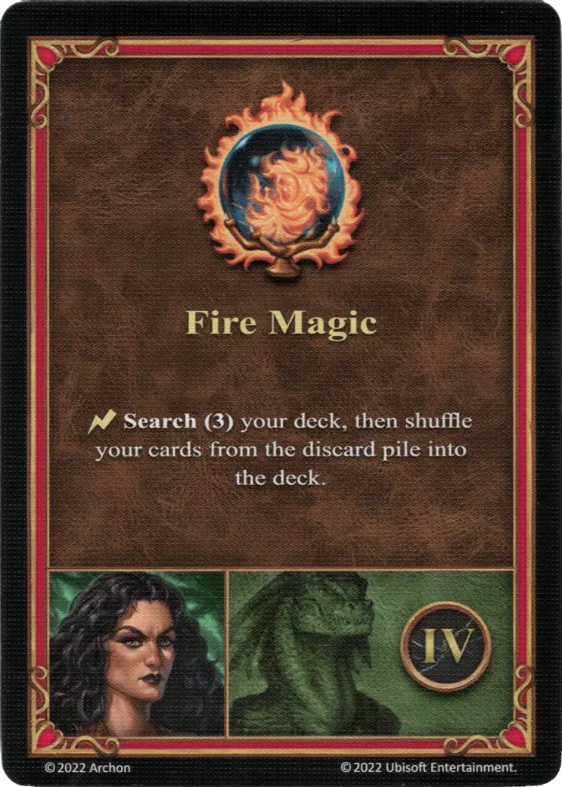

# Adrienne

{ width=540 align=right }

___

[:magic: Witch](index.md)

___

[Fortress](../towns/fortress.md)

___

[:attack:](../statistics/attack.md)&nbsp;0 [:defense:](../statistics/defense.md)&nbsp;1 [:power:](../statistics/power.md)&nbsp;2 [:knowledge:](../statistics/knowledge.md)&nbsp;2

___

[Wisdom](../abilities/wisdom.md)

___

## Specialty

=== "Fire Magic Ⅰ"

    <figure markdown="span">
        { width="340" align=right }
    </figure>

=== "Fire Magic Ⅳ"

    <figure markdown="span">
        { width="340" align=right }
    </figure>

=== "Fire Magic Ⅵ"

    <figure markdown="span">
        { width="340" align=right }
    </figure>

| Level | Description |
| :---: | :---: |
| Ⅰ | :ongoing: During this Combat, all your spells from the [School of Fire Magic](../spells/index.md#school-of-fire-magic) are cast with +1 :power:. |
| Ⅳ | :instant: **Search (3)** your deck, then shuffle your cards from the discard pile into the deck. |
| Ⅵ | :ongoing: During this Combat, all your spells from the [School of Fire Magic](../spells/index.md#school-of-fire-magic) are cast with +2 :power:. |

## Appearances As Player Hero

- Playing With Fire - 1. Farming Towns
- Playing With Fire - 2. March Of The Undead
- Playing With Fire - 3. Burning Of Tatalia

## Comes With

- [Fortress Expansion](../content/fortress_expansion.md)

## See Also

- [List of Heroes](index.md)
- [List of Towns](../towns/index.md)

