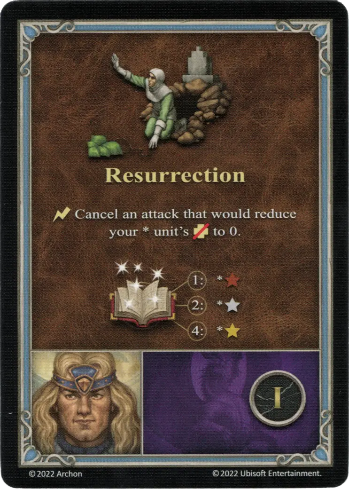

# Alamar

{ width=540 align=right }

___

[:magic: Warlock](index.md)

___

[Dungeon](../towns/dungeon.md)

___

[:attack:](../statistics/attack.md)&nbsp;0 [:defense:](../statistics/defense.md)&nbsp;0 [:power:](../statistics/power.md)&nbsp;3 [:knowledge:](../statistics/knowledge.md)&nbsp;2

___

[Wisdom](../abilities/wisdom.md)

___

## Specialty

=== "Resurrection Ⅰ"

    <figure markdown="span">
        { width="340" align=right }
    </figure>

=== "Resurrection Ⅳ"

    <figure markdown="span">
        { width="340" align=right }
    </figure>

=== "Resurrection Ⅵ"

    <figure markdown="span">
        { width="340" align=right }
    </figure>

| Level | Description |
| :---: | :---: |
| Ⅰ | :instant: Cancel an attack that would reduce your \* [unit's](../units/index.md) :health_points: to 0.   :power: 1 - \*:bronze_tier: :power: 2 - \*:silver: :power: 4 - \*:golden: |
| Ⅳ | :instant: Cancel an attack that would reduce your \* [unit's](../units/index.md) :health_points: to 0.   :power: 0 - \*:bronze_tier: :power: 1 - \*:silver: :power: 3 - \*:golden: |
| Ⅵ | :instant: Cancel an attack that would reduce your \* [unit's](../units/index.md) :health_points: to 0.   :power: 0 - \*:bronze_tier: :power: 0 - \*:silver: :power: 2 - \*:golden: |

## Appearances As Player Hero

- Dragon’s Blood - 2. Blood Of The Dragon Father
- Dragon’s Blood - 3. Blood Thirsty

## Notes

- The specialty can be improved by spell power, just like a regular spell.
- See [Resurrection Spell](../spells/resurrection.md)

## Comes With

- [Core Game](../content/core_game.md)

## See Also

- [List of Heroes](index.md)
- [List of Towns](../towns/index.md)

