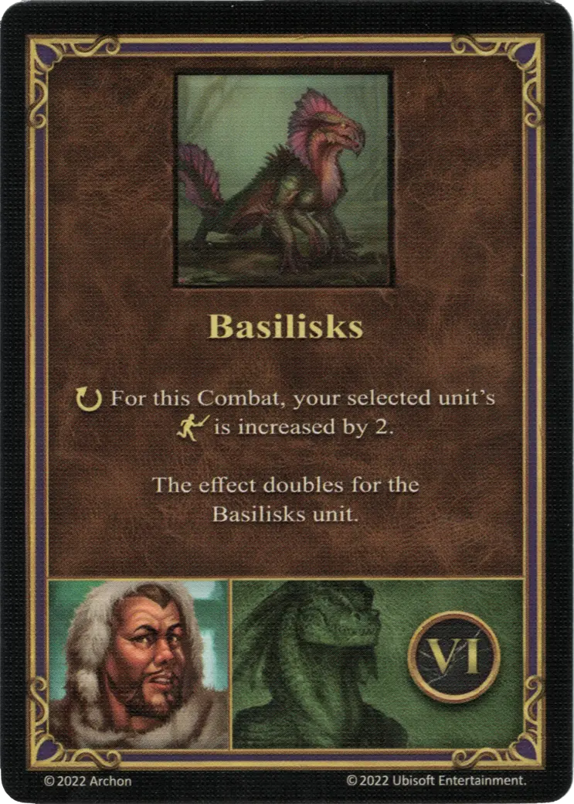

# Bron

___

[:might: Beastmaster](index.md)

___

[Fortress](../towns/fortress.md)

___

| [:attack:](../statistics/attack.md) | [:defense:](../statistics/defense.md) | [:empower:](../statistics/power.md) | [:skill:](../statistics/knowledge.md) | [Ability](../abilities/index.md) | Specialty |
| :---: | :---: | :---: | :---: | :--- | :--- |
| 0 | 4 | 1 | 1 | [Resistance](../abilities/resistance.md) | [Basilisks](#specialty) |

___

## Specialty

=== "Basilisks Ⅰ"

    <figure markdown="span">
        { width="340" align=right }
    </figure>

=== "Basilisks Ⅳ"

    <figure markdown="span">
        { width="340" align=right }
    </figure>

=== "Basilisks Ⅵ"

    <figure markdown="span">
        { width="340" align=right }
    </figure>

| Level | Descrition |
| :---: | :---: |
| Ⅰ | :instant: Your selected [unit](../units/index.md) gains +1 :attack:  — OR —  :instant: Your selected [unit](../units/index.md) gains +1 :defense:  This effect doubles for the [Basilisks unit](../units/basilisks.md). |
| Ⅳ | :ongoing: For this Combat, your selected [unit's](../units/index.md) :health_points: is increased by 1.  This effect doubles for the [Basilisks unit](../units/basilisks.md). |
| Ⅵ | :ongoing: For this Combat, your selected [unit's](../units/index.md) :initiative: is increased by 2.  This effect doubles for the [Basilisks unit](../units/basilisks.md). |

## Comes With

- [Tower Expansion](../content.md)

## See Also

- [List of Heroes](index.md)
- [List of Towns](../towns/index.md)
