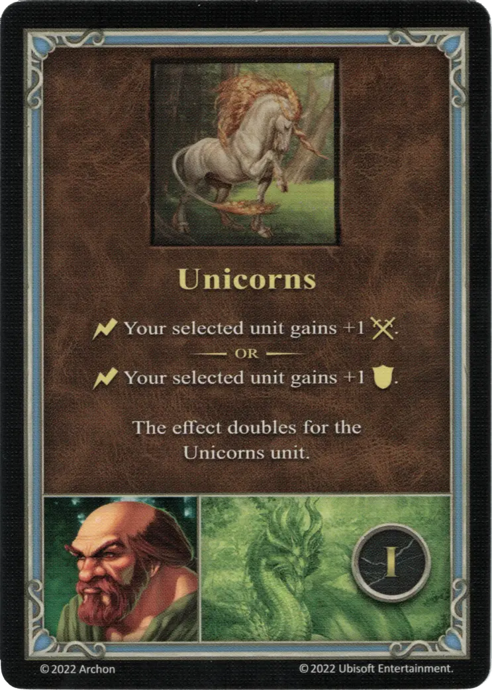

# Clancy

{ width=540 align=right }

___

[:might: Ranger](index.md)

___

[Rampart](../towns/rampart.md)

___

[:attack:](../statistics/attack.md)&nbsp;1 [:defense:](../statistics/defense.md)&nbsp;3 [:power:](../statistics/power.md)&nbsp;1 [:knowledge:](../statistics/knowledge.md)&nbsp;1

___

[Pathfinding](../abilities/pathfinding.md)

___

## Specialty

=== "Unicorns Ⅰ"

    <figure markdown="span">
        { width="340" align=right }
    </figure>

=== "Unicorns Ⅳ"

    <figure markdown="span">
        { width="340" align=right }
    </figure>

=== "Unicorns Ⅵ"

    <figure markdown="span">
        { width="340" align=right }
    </figure>

| Level | Description |
| :---: | :---: |
| Ⅰ | :instant: Your selected [unit](../units/index.md) gains +1 :attack:  — OR —  :instant: Your selected [unit](../units/index.md) gains +1 :defense:  This effect doubles for the [Unicorns unit](../units/unicorns.md). |
| Ⅳ | :ongoing: For this Combat, your selected [unit's](../units/index.md) :initiative: is increased by 1.  This effect doubles for the [Unicorns unit](../units/unicorns.md). |
| Ⅵ | :ongoing: For this Combat, your selected [unit](../units/index.md) reduces any :damage: it takes from spells by 1 - to a minimum of 0.  This effect doubles for the [Unicorns unit](../units/unicorns.md). |

## Comes With

- [Tower Expansion](../content/tower_expansion.md)

## See Also

- [List of Heroes](index.md)
- [List of Towns](../towns/index.md)

