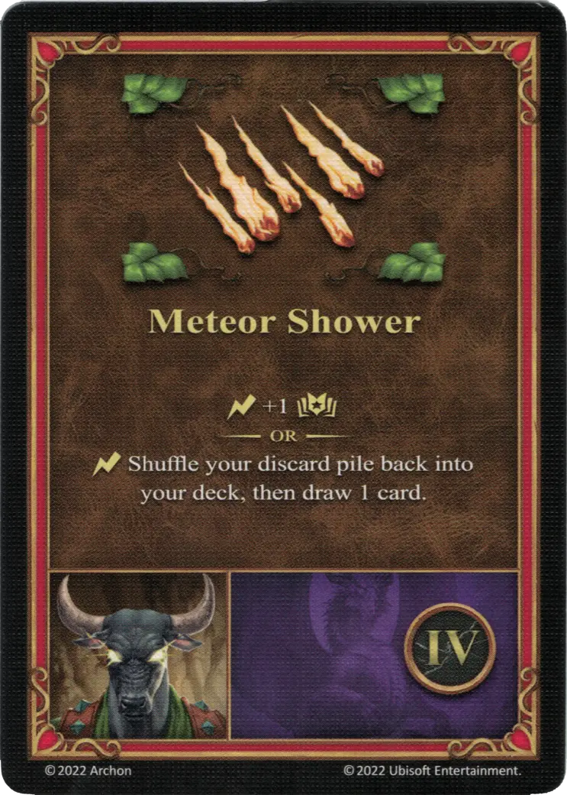

# Deemer

{ width=540 align=right }

___

[:magic: Warlock](index.md)

___

[Dungeon](../towns/dungeon.md)

___

[:attack:](../statistics/attack.md)&nbsp;0 [:defense:](../statistics/defense.md)&nbsp;0 [:empower:](../statistics/power.md)&nbsp;3 [:skill:](../statistics/knowledge.md)&nbsp;2

___

[Scouting](../abilities/scouting.md)

___

## Specialty

=== "Meteor Shower Ⅰ"

    <figure markdown="span">
        { width="340" align=right }
    </figure>

=== "Meteor Shower Ⅳ"

    <figure markdown="span">
        { width="340" align=right }
    </figure>

=== "Meteor Shower Ⅵ"

    <figure markdown="span">
        { width="340" align=right }
    </figure>

| Level | Description |
| :---: | :---: |
| Ⅰ | :instant: Select a [unit](../units/index.md) and 1 [unit](../units/index.md) adjacent to it. Deal \* to both selected [units](../units/index.md).   :empower: 0 - 1 :damage: :empower: 2 - 2 :damage: :empower: 4 - 3 :damage: |
| Ⅳ | :instant: +1 :empower:  — OR —  :instant: Shuffle your discard pile back into your deck, then draw 1 card. |
| Ⅵ | :instant: Select a [unit](../units/index.md) and 2 [units](../units/index.md) adjacent to it. Deal \* to all selected [units](../units/index.md).   :empower: 0 - 1 :damage: :empower: 2 - 2 :damage: :empower: 4 - 3 :damage: |

## Notes

- **Ⅰ and Ⅵ** - The specialty can be improved by spell power, just like a regular spell.
- **Ⅰ and Ⅵ** - The :damage: from Meteor Shower also applies to friendly units.
- These specialties can be played as *instant* effects at any time during Combat, not just during the friendly unit activations.

## Comes With

- [Tower Expansion](../content/tower_expansion.md)

## See Also

- [List of Heroes](index.md)
- [List of Towns](../towns/index.md)

